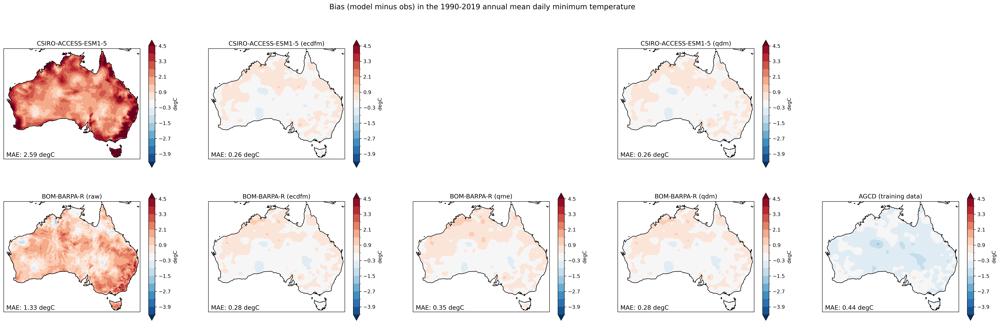

_This report is currently in draft form and is not complete._

# Phase 1 Report

## 1. Introduction

The [Climate Projections Roadmap for Australia](https://www.dcceew.gov.au/climate-change/publications/climate-projections-roadmap-for-australia)
has been developed by the Department of Climate Change, Energy, the Environment and Water (DCCEEW)
through a collaborative effort of the Australian climate projections community.
The roadmap is shared vision statement of this new partnership,
called the National Partnership for Climate Projections (NPCP),
that aims to develop a consistent approach to deliver comparable,
robust, fit-for-purpose future climate information to assess climate risks and inform adaptation planning.

The roadmap identifies a number of priorities areas of collaboration for the NPCP,
including the delivery of national and regional downscaled climate projections.
This involves model selection, downscaling models, bias correction and calibration,
as well as secondary and next-level analysis (e.g., hazard modelling).

When it comes to bias correction there is no "one size fits all" solution.
Over the years, various different methods have been applied by the major projects, universities, and government agencies involved in the NPCP.
Each of these methods have their own pros and cons and are suitable for different applications.
The associated bias correction software also varies
from code that was written for a specific research application (and sometimes subsequently abandoned)
to code that is actively maintained by software engineers and regularly re-used.
In order the deliver the projections data described in the Climate Projections Roadmap for Australia,
there was a clear need to establish an NPCP bias correction intercomparison project
to identify the most appropriate bias correction methods and associated software.

This report summarises the findings of the first phase of the intercomparison project,
which focuses on univariate bias correction methods 
for three climate variables (daily minimum temperature, daily maximum temperature and daily rainfall).
Additional variables and more sophisticated multi-variate bias correction methods will be considered in subsequent phases of the project.

## 2. Participating bias correction methods

The first step in a typical bias correction procedure involves establishing a statistical relationship or transfer function
between model outputs and observations over a reference (i.e. historical/training) time period.
The established transfer function is then applied to the target model data
(e.g. future model projections) in order to produce a "bias corrected" model time series.
There are a wide variety of transfer functions / bias correction methdologies out there,
ranging from relatively simple methods that take a single variable as input
to more sophisticated multi-variate approaches.

Through a series of NPCP meetings and workshops on the topic of bias correction,
a number of individuals from NPCP member organisations/projects stepped forward
with a bias correction method to contribute to the intercomparison.
There were two univariate methods:
equi-distant/ratio cumulative density function matching (ECDFm)
and quantile matching for extremes (QME).

A related univariate "delta change" method
known as quantile delta mapping (QDM) was also included in the assessment.
In contrast to bias correction,
delta change approaches establish a transfer function between reference and future model outputs
(e.g. from an historical model experiment and future climate emission scenario experiment)
and then apply that transfer function to observations to create a future time series.
Application ready climate data was produced using QDM for the
[Climate Change in Australia](https://www.climatechangeinaustralia.gov.au/) project,
so it is useful to compare that approach to traditional bias correction.

All three of the methods are quantile based,
meaning the transfers are a function of quantile.
Each of the methods is described in detail below.

### 2.1. ECDFm

#### 2.1.1. Method

In *equidistant cumulative density function matching* ([Li et al, 2010](https://doi.org/10.1029/2009JD012882)),
the transfer function represents the distance (i.e. arithmetic difference)
between the observations and model for each quantile of the training period.
Those differences are then added to the target model data
according to the quantile each target data point represents over the target period.
For instance, if a target temperature of $25^{\circ}$ Celsius corresponds to the 0.5 quantile (i.e. the median) in the target data,
the difference between the median value in the observations and reference model data
is added to the target value in order to obtain the bias adjusted value.
The underlying assumption is that the distance between the model and observed quantiles during the training period
also applies to the target period, hence the name *equidistant*.
The reference to *CDF matching* is clear from the mathematical representation of the method:
$$x_{m-adjust} = x_{m,p} + F_{o,h}^{-1}(F_{m,p}(x_{m,p})) - F_{m,h}^{-1}(F_{m,p}(x_{m,p}))$$
where $F$ is the CDF of either the observations ($o$) or model ($m$) for a historic training period ($h$) or target period ($p$).
That means $F_{o,h}^{-1}$ and $F_{m,h}^{-1}$ are the quantile functions (inverse CDF) corresponding to the observations and model respectively.
Returning to our target median value of $25^{\circ}$ (i.e. $x_{m,p} = 25$),
the corresponding CDF would return a value of 0.5 (i.e. $F_{m,p}(25) = 0.5$).
The difference between the observed ( $F_{o,h}^{-1}(0.5)$ )
and reference model ( $F_{m,h}^{-1}(0.5)$ ) median values
would then be added to the target value of $25^{\circ}$ to get a bias corrected value.

For precipitation, multiplicative as opposed to additive bias correction is preferred
to avoid the possibility of getting bias corrected values less than zero.
In this case, *equiratio CDF matching* ([Wang and Chen, 2013](https://doi.org/10.1002/asl2.454)) is used:
$$x_{m-adjust} = x_{m,p} \times (F_{o,h}^{-1}(F_{m,p}(x_{m,p})) \div F_{m,h}^{-1}(F_{m,p}(x_{m,p})))$$

Besides incredibly simple bias correction approaches like mean scaling
(i.e. where the difference in the mean between the model and observations
is simply removed from all data points),
ECDFm is effectively the most basic (and thus easy to understand/explain)
bias correction method available.

#### 2.1.2. Software (and implementation choices)

The code used to implement the ECDFm method is maintained by the CSIRO Climate Innovation Hub
and is openly available on [Github](https://github.com/climate-innovation-hub/qqscale).
The code basically implements the [bias adjustment and downscaling](https://xclim.readthedocs.io/en/stable/sdba.html)
functionality available in the widely used open source xclim library.

There are a number of decisions to make when implementing the ECDFm method:
- _Time grouping_:
  It is common to bias correct individual seasons or months separately to avoid conflating different times of the year
  (e.g. spring and autumn temperatures often occupy the same annual quantile space but may be biased in different ways).
  We use monthly time grouping. 
- _Qunatiles (number and interpolation)_:
  The software allows the user to specify the number of quantiles to calculate
  and what interpolation method to use to determine the bias correction for target data points that fall between quantiles/months.
  We've found that it's best to have approximately 10-15 data values between each quantile.
  For the NPCP bias correction tasks (that train on 30 or 40 years of daily data),
  that means 100 quantiles for monthly time grouping.
  We apply linear interpolation.
- _Singularity stochastic removal_ ([Vrac et al 2016](https://doi.org/10.1002/2015JD024511))
  is used to avoid divide by zero errors in the analysis of precipitation data.
  All near-zero values (i.e. values less than a very small positive threshold value)
  are set to a small random non-zero value prior to data processing,
  and then after the bias correction process is complete any values less than the threshold are set to zero.

### 2.2. QME

#### 2.2.1. Method
TODO.

#### 2.2.2. Software (and implementation choices) 
TODO.

### 2.3. QDM

#### 2.3.1 Method

One of the most widely used methods for producing climate projection data is the so-called "delta change" approach.
Rather than use the data from a model simulation of the future climate directly,
the delta change approach calculates the relative change between a future and historical modelled time period.
That relative change is then applied to observed data from the same historical time period in order to produce an "application ready" time series for the future period.

While the simplest application of the delta change approach is to apply the mean model change to the observed data,
a popular alternative is to calculate and apply the delta changes on a quantile by quantile basis.
For instance, if an observed historical temperature of $25^{\circ}$ Celsius corresponds to the 0.5 quantile (i.e. the median) in the observed data,
the difference between the median value in the future and historical model data is added to that observed historical temperature
in order to obtain the projected future temperature.

This method is known as Quantile Delta Mapping (QDM; [Cannon et al 2015](https://doi.org/10.1175/JCLI-D-14-00754.1))
and is expressed mathematically as follows:
$$x_{o,p} = x_{o,h} + F_{m,p}^{-1}(F_{o,h}(x_{o,h})) - F_{m,h}^{-1}(F_{o,h}(x_{o,h}))$$
where $F$ is the CDF of either the observations ($o$) or model ($m$) for an historic ($h$) or future/projection period ($p$).
That means $F_{m,p}^{-1}$ and $F_{m,h}^{-1}$ are the quantile functions (inverse CDF)
corresponding to the future and historical model simulations respectively.
Returning to our observed median value of $25^{\circ}$ (i.e. $x_{o,h} = 25$),
the corresponding CDF would return a value of 0.5 (i.e. $F_{o,h}(25) = 0.5$).
The difference between the future ( $F_{m,p}^{-1}(0.5)$ ) and historical model ( $F_{m,h}^{-1}(0.5)$ ) median values
would then be added to the observed value of $25^{\circ}$ to get the projected future temperature.

For variables like precipitation, multiplicative as opposed to additive mapping is preferred
to avoid the possibility of producing future values less than zero:
$$x_{o,p} = x_{o,h} \times (F_{m,p}^{-1}(F_{o,h}(x_{o,h})) \div F_{m,h}^{-1}(F_{o,h}(x_{o,h})))$$

#### 2.3.2. Software (and implementation choices)

Since both methods are conceptually very similar,
the QDM method is implemented using the same software as the ECDFm method.
The same implementation choices are made regarding time grouping, quantiles and singularity stochastic removal.
The only difference is when processing precipitation data (a multiplicative application of QDM)
we've found that in many locations the model bias in the timing of the seasonal cycle
means that monthly time grouping dramatically modifies the climate trend in the dat
(i.e. the mean change between the future data produced by QDM and the observations
is much different than the mean change between the future and historical model simulations).
As such, we don't apply any time grouping when applying QDM to precipitation data
and use 1000 quantiles in order to still have 10-15 data values between each quantile. 

## 3. Data

The model data used for the intercomparison was taken from the multi-scenario,
multi-model ensemble of simulations from regional climate models (RCMs)
that will form the basis for much of the climate projection information delivered by NPCP members.
The ensemble represents a subset of realisations from CMIP6 global climate models (GCMs)
selected for dynamical downscaling by RCMs under a ‘sparse matrix’ framework ([Grose et al 2023](https://doi.org/10.1016/j.cliser.2023.100368)).

For the purposes of the intercomparison,
we used dynamically downscaled daily timescale temperature and precipitation data
from simulations forced by GCM data from the ACCESS-ESM1-5 model for the
historical (available for the years 1960-2014)
and SSP370 (2015-2100) experiments.
Data from four different RCMs was assessed:
- `BOM-BARPA-R`:
  Bureau of Meteorology Atmospheric Regional Projections for Australia
  (BARPA; [Su et al 2022](http://www.bom.gov.au/research/publications/researchreports/BRR-069.pdf)),
  run by the Bureau of Meteorology
- `CSIRO-CCAM-2203`:
  Conformal Cubic Atmospheric Model (CCAM),
  run by CSIRO
- `UQ-DES-CCAM-2105`:
  CCAM,
  run by the University of Queensland and the Queensland Department of Environment and Science
  ([Chapman et al 2023](https://doi.org/10.1029/2023EF003548))
- `NARCLIM-WRF`:
  Weather Research and Forecasting (WRF) model,
  run by the New South Wales Australian Regional Climate Modelling (NARCLiM) project

The observational / reference data used for the bias correction
was the Australian Gridded Climate Data (AGCD) dataset
([Evans et al 2020](http://www.bom.gov.au/research/publications/researchreports/BRR-041.pdf),
[Jones et al 2009](http://www.bom.gov.au/jshess/docs/2009/jones.pdf)).
The spatial resolution of the datasets ranged from 0.5 degrees of latitude and longitude (AGCD)
to 0.2 degrees (UQ-DES-CCAM-2015) over the entire landmass of Australia,
so all data was regridded to the 0.2 degree grid using conservative remapping.

## 4. Assessment

Each contributor to the intercomparison was asked to use their bias correction software to complete three tasks
(for each of the four RCMs):
- **Task 1 (Historical)**: Produce bias corrected data for the 1980-2019 period, using 1980-2019 as a training period.
- **Task 2 (Projection)**: Produce bias corrected data for the 2060-2099 period, using 1980-2019 as a training period.
- **Task 3 (Cross validation)**: Produce bias corrected data for the 1990-2019 period, using 1960-1989 as a training period.

The rationale for the historical task was to assess how well the bias correction methods perform
when they train on exactly the same data that they correct.
This is the most basic test of a bias correction method - if a method cannot adequately correct the very data it trained on,
it is unlikely to be a useful method.
Conversely, if a method performs too well at the historical task,
this can be an indication of over-fitting.
The cross validation task assesses how well the methods perform when producing data
for a different time period than the training period,
which is a more difficult test (and also a very common application).
The projection task was included to see if the bias correction methods substantially modify the trend simulated by the models.
Trend modification is a problem for many bias correction methods.

Since the ensemble of GCMs selected for dynamical downscaling by RCMs is only a subset of the full CMIP6 ensemble,
some NPCP members are also interested in applying bias correction directly to GCM output.
In order to better understand how GCM outputs that have been dynamically downscaled and then bias corrected
compare to GCM outputs that are directly bias corrected,
the three assessment tasks were also completed on the ACCESS-ESM1-5 output
using the ECDFM and QDM methods.

The data arising from each bias correction method was compared on a number of metrics
relating to the ability to capture the observed
climatology (annual mean and monthly mean),
variability (e.g. wet day frequency, drought intensity, rainfall distribution, heat wave duration),
extremes (e.g. 99th percentile, 1-in-10 year event),
trends
and the link between variables (e.g. cross correlation between temperature and precipitation).
The results for each of those metrics are presented below.

## 5. Results: Temperature

### 5.1. Climatology

> Summary: There's essentially no difference between the univariate bias correction methods
> with respect to the daily minimum and maximum temperature climatologies.
> While the raw RCM data is less biased than the raw GCM data,
> it also makes no difference whether the GCM data is dynamically downscaled or not
> prior to applying bias correction.

With respect to daily minimum and maximum temperature,
all the univariate bias correction methods do an almost perfect job of
representing the observed (AGCD) 1980-2019 annual mean
when trained on that same 1980-2019 observed data
(i.e. the historical assessment task; e.g. Figure 1).

    
     
    <em>
      Figure 1: Bias in annual mean daily maximum temperature (relative to the AGCD dataset)
      for the "historical" assessment task.
      Results are shown for a GCM (top left),
      RCM forced by that GCM (bottom left)
      and various bias correction methods applied to those model data (rows).
      (MAE = mean absolute error.)
    </em>

For the cross validation task,
all the bias correction methods perform similarity well with respect to the annual mean (e.g. Figure 2).
The relative ranking of the methods in terms of the spatial mean absolute error
differs depending on exactly which RCM and variable is assessed.
It does not appear to make much difference whether the data are dynamically downscaled
prior to bias correction or not.

    
     
    <em>
      Figure 2: Bias in annual mean daily minimum temperature (relative to the AGCD dataset)
      for the "cross validation" assessment task.
      Results are shown for a GCM (top left),
      RCM forced by that GCM (bottom left),
      various bias correction methods applied to those model data (rows),
      and a reference case where the AGCD training data (1960-1989)
      was simply duplicated for the assessment period (1990-2019) (bottom right).
      (MAE = mean absolute error.)
    </em>

### 5.2. Variability
TODO.

### 5.3. Extremes
TODO.

### 5.4. Trends
TODO.

### 5.5. Link between variables
TODO.

## 6. Results: Precipitation

### 6.1. Climatology
TODO.

### 6.2. Variability
TODO.

### 6.3. Extremes
TODO.

### 6.4. Trends
TODO.

### 6.5. Link between variables
TODO.

## 7. Discussion
TODO
