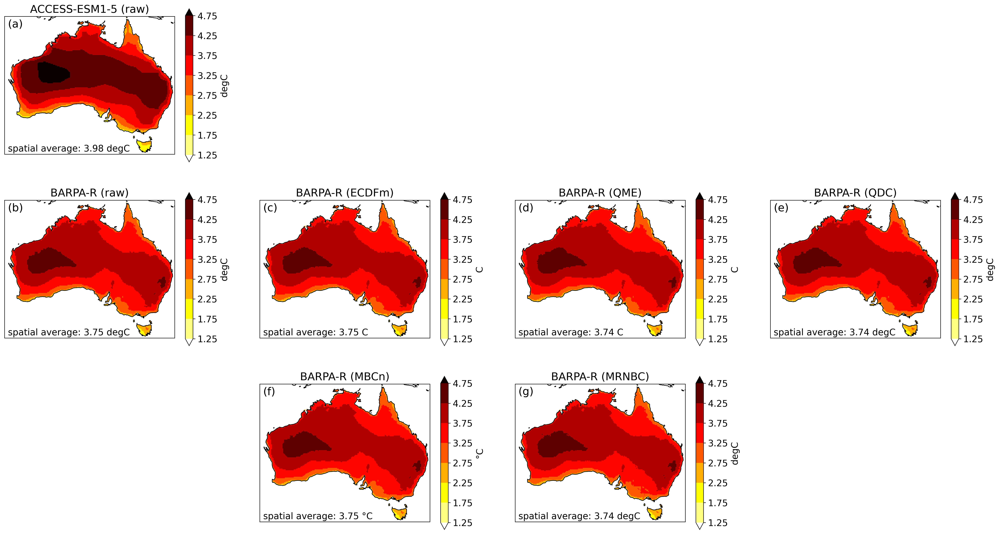

_This report is currently in draft form and is not complete._

# Phase 1 Report

[1. Introduction](#1-introduction)  
[2. Participating bias correction methods](#2-participating-bias-correction-methods)  
&ensp; [2.1. ECDFm](#21-ecdfm)  
&ensp; [2.2. QME](#22-qme)  
&ensp; [2.3. QDC](#23-qdc)  
&ensp; [2.4. MBCn](#24-mbcn)  
&ensp; [2.5. MRNBC](#25-mrnbc)  
[3. Data](#3-data)  
[4. Assessment](#4-assessment)  
[5. Results: Temperature](#5-results-temperature)  
&ensp; [5.1. Temperature climatology](#51-temperature-climatology)  
&ensp; [5.2. Temperature variability](#52-temperature-variability)  
&ensp; [5.3. Temperature extremes](#53-temperature-extremes)  
&ensp; [5.4. Temperature trends](#54-temperature-trends)  
[6. Results: Precipitation](#6-results-precipitation)  
&ensp; [6.1. Precipitation climatology](#61-precipitation-climatology)  
&ensp; [6.2. Precipitation variability](#62-precipitation-variability)  
&ensp; [6.3. Precipitation daily distribution](#63-precipitation-daily-distribution)  
&ensp; [6.4. Precipitation extremes](#64-precipitation-extremes)  
&ensp; [6.5. Precipitation trends](#65-precipitation-trends)  
[7. Results: Link between variables](#7-results-link-between-variables)  
[8. Discussion](#8-discussion)  

## 1. Introduction

The [Climate Projections Roadmap for Australia](https://www.dcceew.gov.au/climate-change/publications/climate-projections-roadmap-for-australia)
has been developed by the Department of Climate Change, Energy, the Environment and Water (DCCEEW)
through a collaborative effort of the Australian climate projections community.
The roadmap is shared vision statement of this new partnership,
called the National Partnership for Climate Projections (NPCP),
that aims to develop a consistent approach to deliver comparable,
robust, fit-for-purpose future climate information to assess climate risks and inform adaptation planning.

The roadmap identifies a number of priorities areas of collaboration for the NPCP,
including the delivery of national and regional downscaled climate projections.
This involves model selection, downscaling models, bias correction and calibration,
as well as secondary and next-level analysis (e.g., hazard modelling).

When it comes to bias correction there is no "one size fits all" solution.
Over the years, various different methods have been applied by the major projects, universities, and government agencies involved in the NPCP.
Each of these methods have their own pros and cons and are suitable for different applications.
The associated bias correction software also varies
from code that was written for a specific research application (and sometimes subsequently abandoned)
to code that is actively maintained by software engineers and regularly re-used.
In order the deliver the projections data described in the Climate Projections Roadmap for Australia,
there was a clear need to establish an NPCP bias correction intercomparison project
to identify the most appropriate bias correction methods and associated software.

This report summarises the findings of the first phase of the intercomparison project,
which focuses on the bias correction methods used by the institutions
participating in the Australian Climate Service (CSIRO and the Bureau of Meteorology) 
for three climate variables (daily minimum temperature, daily maximum temperature and daily rainfall).
Additional variables and bias correction methods from other institutions will be considered in subsequent phases of the project.

## 2. Participating bias correction methods

The first step in a typical bias correction procedure involves establishing a statistical relationship or transfer function
between model outputs and observations over a reference (i.e. historical/training) time period.
The established transfer function is then applied to the target model data
(e.g. future model projections) in order to produce a "bias corrected" model time series.
There are a wide variety of transfer functions / bias correction methodologies out there,
ranging from relatively simple methods that take a single variable as input
to more sophisticated multi-variate approaches.

Through a series of NPCP meetings and workshops on the topic of bias correction,
a number of individuals from the Australian Climate Service stepped forward
with a bias correction method to contribute to the intercomparison:
- Equi-distant/ratio Cumulative Density Function matching (ECDFm; univariate)
- Quantile Matching for Extremes (QME; univariate)
- Quantile Delta Change (QDC; univariate)
- N-Dimensional Multi-Variate Bias Correction (MBCn; multivariate)
- Multivariate Recursive Nesting Bias Correction (MRNBC; multivariate)

All three of the univariate methods are quantile-based,
meaning the applied transfers are a function of quantile.
Quantile methods are a popular and slightly more sophisticated approach than mean scaling,
where the bias (i.e. a difference or ratio) in the mean between the model and observations is
removed from all model data points of interest.
The ECDFm method is essentially the most basic quantile-based bias correction method available.
The bias is calculated for a series of quantiles (instead of just the mean)
and then removed from the corresponding quantiles of the model data of interest.
The QME method is slightly more complicated in that it involves scaling the data
before matching the model and observations by quantile.
Prior to removing the quantile biases from the model data of interest,
the bias correction factors at the extreme ends of the distribution are also modified
in an attempt to avoid potential overfitting or an excessive influence of very rare events.

While it is technically a "delta change" method as opposed to a "bias correction" method,
the QDC method was also included in the assessment.
In contrast to bias correction,
delta change approaches establish a transfer function between reference and future model outputs
(e.g. from an historical model experiment and future climate emission scenario experiment)
and then apply that transfer function to observations to create a future time series.
Application ready climate data was produced using QDC for the
[Climate Change in Australia](https://www.climatechangeinaustralia.gov.au/) project,
so it is useful to compare that approach to traditional bias correction.
The QDC method is conceptually very similar to ECDFm
and is essentially the most basic quantile-based delta change method available.

Unlike the univariate approaches,
multivariate techniques tend to be iterative,
whereby a bias correction method is applied repeatedly until convergence is reached
(i.e. until the biases are no longer getting smaller).
The MBCn method is quantile-based,
repeatedly applying a multivariate orthogonal rotation to the data followed by the univariate QDC method.
In contrast, the MRNBC method is not quantile-based
and instead attempts to address biases in serial dependence
by correcting the data for biases in the mean, standard deviation and lag-0 and lag-1 auto and cross correlations
at multiple timescales (daily, monthly, seasonal and annual).

Each of the methods is described in more detail below.

### 2.1. ECDFm

#### 2.1.1. Method

In *equidistant cumulative density function matching* ([Li et al, 2010](https://doi.org/10.1029/2009JD012882)),
the transfer function represents the distance (i.e. arithmetic difference)
between the observations and model for each quantile of the training period.
Those differences are then added to the target model data
according to the quantile each target data point represents over the target period.
For instance, if a target temperature of $25^{\circ}$ Celsius corresponds to the 0.5 quantile (i.e. the median) in the target data,
the difference between the median value in the observations and reference model data
is added to the target value in order to obtain the bias adjusted value.
The underlying assumption is that the distance between the model and observed quantiles during the training period
also applies to the target period, hence the name *equidistant*.
The reference to *CDF matching* is clear from the mathematical representation of the method:
$$x_{m-adjust} = x_{m,p} + F_{o,h}^{-1}(F_{m,p}(x_{m,p})) - F_{m,h}^{-1}(F_{m,p}(x_{m,p}))$$
where $F$ is the CDF of either the observations ($o$) or model ($m$) for a historic training period ($h$) or target period ($p$).
That means $F_{o,h}^{-1}$ and $F_{m,h}^{-1}$ are the quantile functions (inverse CDF) corresponding to the observations and model respectively.
Returning to our target median value of $25^{\circ}$ (i.e. $x_{m,p} = 25$),
the corresponding CDF would return a value of 0.5 (i.e. $F_{m,p}(25) = 0.5$).
The difference between the observed ( $F_{o,h}^{-1}(0.5)$ )
and reference model ( $F_{m,h}^{-1}(0.5)$ ) median values
would then be added to the target value of $25^{\circ}$ to get a bias corrected value.

For precipitation, multiplicative as opposed to additive bias correction is preferred
to avoid the possibility of getting bias corrected values less than zero.
In this case, *equiratio CDF matching* ([Wang and Chen, 2013](https://doi.org/10.1002/asl2.454)) is used:
$$x_{m-adjust} = x_{m,p} \times (F_{o,h}^{-1}(F_{m,p}(x_{m,p})) \div F_{m,h}^{-1}(F_{m,p}(x_{m,p})))$$

#### 2.1.2. Software (and implementation choices)

The code used to implement the ECDFm method is maintained by the CSIRO Climate Innovation Hub
and is openly available on [GitHub](https://github.com/climate-innovation-hub/qqscale).
The code basically implements the [bias adjustment and downscaling](https://xclim.readthedocs.io/en/stable/sdba.html)
functionality available in the widely used open source xclim library.

There are a number of decisions to make when implementing the ECDFm method:
- _Time grouping_:
  It is common calculate bias correction adjustment factors for individual seasons or months separately
  in order to avoid conflating different times of the year
  (e.g. spring and autumn temperatures often occupy the same annual quantile space but may be biased in different ways).
  For the NPCP intercomparsion, adjustment factors were calculated for each month.
- _Quantiles_:
  The software allows the user to specify the number of quantiles for which to calculate an adjustment factor.
  We've found that it's best to have approximately 10-15 data values between each quantile.
  For the NPCP bias correction tasks (that train on 30 or 40 years of daily data),
  that means 100 quantiles for each month.
- _Adjustment factor smoothing_:
  The bias correction applied to each target data point is the closest value from the array of adjustment factors.
  In this case, it is a 12 (months) by 100 (quantiles) array
  and linear interpolation/smoothing is applied along the month axis.
  That means the adjustment factor for a target data point from 29 July that corresponds to the 0.651 quantile
  will be a linear combination of the adjustment factors for the nearest quantile (0.65) from both July and August.
- _Singularity stochastic removal_ ([Vrac et al 2016](https://doi.org/10.1002/2015JD024511))
  is used to avoid divide by zero errors in the analysis of precipitation data.
  All near-zero values (i.e. values less than a very small positive threshold value)
  are set to a small random non-zero value prior to data processing,
  and then after the bias correction process is complete any values less than the threshold are set to zero.

### 2.2. QME

#### 2.2.1. Method

The _quantile matching for extremes_ ([Dowdy 2023](http://www.bom.gov.au/research/publications/researchreports/BRR-087.pdf))
method involves clipping the input data to a valid range
and then scaling the clipped data to an integer value between 0 and 500 (typically)
before applying the quantile-based transfer function.
This scaling can be thought of as binning the data
(in this case, a histogram with 500 bins).

A typical valid data range might be -30C to 60C for daily maximum temperature (tasmax),
-45C to 50C for daily minimum temperature (tasmin),
or 0mm to 1250mm for daily precipitation (pr).
The following scaling formulas (used in this intercomparison)
map the valid range of data values across the 500 integer values/bins: 
- (tasmax + 35) * 5
- (tasmin + 55) * 5
- alog(pr + 1) * 70, where alog is the natural logarithm 

A small value of 0.1mm would have a scaled value of alog(0.1 + 1) * 70 = 6.7,
which is rounded to an integer value / bin number of 7.
The largest valid rainfall amount of 1250mm would have a scaled value of alog(1250 + 1 ) * 70 = 499.2 (rounded to 499).

> TODO - Describe quantile matching process.
>
> Things to clarify:
>   - How many quantiles does it calculate? 100?
>   - I’m assuming that for temperature data the input and reference quantiles are compared additively
>     (e.g. the bias / adjustment factor for the 0.2 quantile is the arithmetic difference
>     between the input 0.2 quantile and the reference 0.2 quantile).
>     For rainfall is it a multiplicative comparison (i.e. the bias is the ratio)
>     to avoid issues around potentially producing adjusted rainfall amounts less than zero?
>   - When it comes to correcting model data outside the training period (let’s call it future data),
>     let’s say you have a transformed future value of 150.
>     Does the QME method figure out what quantile 150 corresponds to in the input training data
>     (and then applies the adjustment factor for that quantile)
>     or does it figure out what quantile 150 corresponds to in the future data
>     (and then applies the adjustment factor for that quantile).
>   - If a future data value falls between two quantiles,
>     does QME just apply the adjustment factor for the quantile it’s closest to?

To avoid potential overfitting or an excessive influence of very rare events,
before the adjustment factor for each ranked bin is applied to the target data
the factors for the N most extreme high and extreme low bins (typically N=3)
are replaced by the value from the neighbouring histogram bin
(i.e., the histogram bin that is one place less extreme than the third highest value in the sample).
The reference to _extremes_ in the name of the method is a nod to these tweaks
to the quantile adjustments in the tails of the distribution. 

#### 2.2.2. Software (and implementation choices) 

The original IDL code used to implement the QME method is maintained by Andrew Dowdy at the University of Melbourne.
A copy of the code as at October 2023 is included in the appendix of the Bureau of Meteorology research report
that documents the QME method ([Dowdy 2023](http://www.bom.gov.au/research/publications/researchreports/BRR-087.pdf)),
while the very latest version is available from Andrew by request.
The Bureau of Meteorology has also written a Python implementation of the method
that is openly available on [GitHub](https://github.com/AusClimateService/QME).

There are a number of decisions to make when implementing the QDC method:
- _Time grouping_:
  Similar to ECDFm, it is common to apply the QME method to individual seasons or months separately.
  Monthly time grouping was used for this NPCP intercomparsion.
- _Quantiles_:
  TODO - Find out if there are options here.
- _Adjustment factor smoothing_:
  A 21-point moving average was applied over the range of bias correction values (i.e. for bins 0 to 500) for each month.
  TODO: Check if this is correct.
- _Adjustment limits_:
  The software allows the user to specify a maximum adjustment/correction. 
  The default setting for precipitation (used in this intercomparison)
  is for a maximum increase of 50% applied to values great than or equal to 10mm.
  For instance, a model daily precipitation value of 20mm could potentially be bias corrected
  up to a maximum value of 30mm.
- _Trend matching_: The long-term trend in the data can be removed prior to applying the bias correction,
  and then added back in after the bias correction has been applied in order to ensure that the bias correction
  does not substantially alter the model simulated trend.
  This option was applied for the temperature data in the projection assessment task (described below).

### 2.3. QDC

#### 2.3.1 Method

One of the most widely used methods for producing climate projection data is the so-called "delta change" approach.
Rather than use the data from a model simulation of the future climate directly,
the delta change approach calculates the relative change between a future and historical modelled time period.
That relative change is then applied to observed data from the same historical time period in order to produce an "application ready" time series for the future period.

While the simplest application of the delta change approach is to apply the mean model change to the observed data,
a popular alternative is to calculate and apply the delta changes on a quantile by quantile basis
(i.e. to adjust the variance of the distribution as opposed to just the mean).
For instance, if an observed historical temperature of $25^{\circ}$ Celsius corresponds to the 0.5 quantile (i.e. the median) in the observed data,
the difference between the median value in the future and historical model data is added to that observed historical temperature
in order to obtain the projected future temperature.

This *quantile delta change* (QDC) approach
([Olsson et al 2009](https://doi.org/10.1016/j.atmosres.2009.01.015);
[Willems & Vrac 2011](https://doi.org/10.1016/j.jhydrol.2011.02.030))
is expressed mathematically as follows:
$$x_{o,p} = x_{o,h} + F_{m,p}^{-1}(F_{o,h}(x_{o,h})) - F_{m,h}^{-1}(F_{o,h}(x_{o,h}))$$
where $F$ is the CDF of either the observations ($o$) or model ($m$) for an historic ($h$) or future/projection period ($p$).
That means $F_{m,p}^{-1}$ and $F_{m,h}^{-1}$ are the quantile functions (inverse CDF)
corresponding to the future and historical model simulations respectively.
Returning to our observed median value of $25^{\circ}$ (i.e. $x_{o,h} = 25$),
the corresponding CDF would return a value of 0.5 (i.e. $F_{o,h}(25) = 0.5$).
The difference between the future ( $F_{m,p}^{-1}(0.5)$ ) and historical model ( $F_{m,h}^{-1}(0.5)$ ) median values
would then be added to the observed value of $25^{\circ}$ to get the projected future temperature.

For variables like precipitation, multiplicative as opposed to additive mapping is preferred
to avoid the possibility of producing future values less than zero:
$$x_{o,p} = x_{o,h} \times (F_{m,p}^{-1}(F_{o,h}(x_{o,h})) \div F_{m,h}^{-1}(F_{o,h}(x_{o,h})))$$

#### 2.3.2. Software (and implementation choices)

Since both methods are conceptually very similar,
the QDC method is implemented using the same software as the ECDFm method.
The same implementation choices are made regarding time grouping, quantiles and singularity stochastic removal.
The only difference is when processing precipitation data (a multiplicative application of QDC)
we've found that in many locations the model bias in the timing of the seasonal cycle
means that monthly time grouping dramatically modifies the climate trend in the data
(i.e. the mean change between the future data produced by QDC and the observations
is much different than the mean change between the future and historical model simulations).
As such, we don't apply any time grouping when applying QDC to precipitation data
and use 1000 quantiles in order to still have 10-15 data values between each quantile. 

### 2.4. MBCn

#### 2.4.1. Method

> TODO

#### 2.4.2. Software (and implementation choices)

> TODO

### 2.5. MRNBC

#### 2.5.1. Method

> TODO

#### 2.5.2. Software (and implementation choices)

> TODO

## 3. Data

The model data used for the intercomparison was taken from the multi-scenario,
multi-model ensemble of simulations from regional climate models (RCMs)
that will form the basis for much of the climate projection information delivered by NPCP members.
The ensemble represents a subset of realisations from CMIP6 global climate models (GCMs)
selected for dynamical downscaling by RCMs under a ‘sparse matrix’ framework ([Grose et al 2023](https://doi.org/10.1016/j.cliser.2023.100368)).

For the purposes of the intercomparison,
we used dynamically downscaled daily timescale temperature and precipitation data
from simulations forced by GCM data from the ACCESS-ESM1-5 model for the
historical (available for the years 1960-2014)
and SSP370 (2015-2100) experiments.
Data from three different RCMs was assessed:
- `BOM-BARPA-R`:
  Bureau of Meteorology Atmospheric Regional Projections for Australia
  (BARPA; [Su et al 2022](http://www.bom.gov.au/research/publications/researchreports/BRR-069.pdf)),
  run by the Bureau of Meteorology
- `CSIRO-CCAM-2203`:
  Conformal Cubic Atmospheric Model (CCAM),
  run by CSIRO
- `UQ-DES-CCAM-2105`:
  CCAM,
  run by the University of Queensland and the Queensland Department of Environment and Science
  ([Chapman et al 2023](https://doi.org/10.1029/2023EF003548))

The observational / reference data used for the bias correction
was the Australian Gridded Climate Data (AGCD) dataset
([Evans et al 2020](http://www.bom.gov.au/research/publications/researchreports/BRR-041.pdf),
[Jones et al 2009](http://www.bom.gov.au/jshess/docs/2009/jones.pdf)).
The spatial resolution of the datasets ranged from 0.5 degrees of latitude and longitude (AGCD)
to 0.2 degrees (UQ-DES-CCAM-2015) over the entire landmass of Australia,
so all data was regridded to the 0.2 degree grid using conservative remapping.

## 4. Assessment

Each contributor to the intercomparison was asked to use their bias correction software to complete three tasks
(for each of the three RCMs):
- **Task 1 (Historical)**: Produce bias corrected data for the 1980-2019 period, using 1980-2019 as a training period.
- **Task 2 (Projection)**: Produce bias corrected data for the 2060-2099 period, using 1980-2019 as a training period.
- **Task 3 (Cross validation)**: Produce bias corrected data for the 1990-2019 period, using 1960-1989 as a training period.

The rationale for the historical task was to assess how well the bias correction methods perform
when they train on exactly the same data that they correct.
This is the most basic test of a bias correction method - if a method cannot adequately correct the very data it trained on,
it is unlikely to be a useful method.
Conversely, if a method performs too well at the historical task,
this can in some cases be an indication of over-fitting.
(The historical task was not completed for the QDC method since
by definition that method would achieve a perfect score by simply returning the observations un-adjusted.)
The cross validation task assesses how well the methods perform when producing data
for a different time period than the training period,
which is a more difficult test (and also the typical application for bias correction methods).
The projection task was included to see if the bias correction methods substantially modify the trend simulated by the models.
Trend modification is a problem for many bias correction methods.

Since the ensemble of GCMs selected for dynamical downscaling by RCMs is only a subset of the full CMIP6 ensemble,
some NPCP members are also interested in applying bias correction directly to GCM output.
In order to better understand how GCM outputs that have been dynamically downscaled and then bias corrected
compare to GCM outputs that are directly bias corrected,
the three assessment tasks were also completed on the ACCESS-ESM1-5 output
using the ECDFM and QDC methods.

The data arising from each bias correction method was compared on a number of metrics
relating to the ability to capture the observed
climatology, variability, distribution (precipitation only), extremes, trends and the link between different variables.
The metrics presented and/or discussed in the results section of this report are listed in Table 1.
Some additional metrics can be found at the following GitHub repository
along with the complete results for all variable / RCM / metric combinations:  
https://github.com/AusClimateService/npcp/tree/master/results

| Category | Metric | Description |
| ---      | ---    | ---         |
| Climatology | Annual climatology | Annual mean at each grid point |
| Climatology | Seasonal cycle bias | Sum of the absolute value of the difference between the bias corrected model and observed climatological mean value for each month |
| Variability | Interannual variability | Standard deviation of the annual mean timeseries |
| Variability | Multi-year variability | Standard deviation of the 5-year running mean timeseries |
| Variability | Temporal auto-correlation | Correlation between the annual (or monthly) time series and a lag-1-shifted version of that annual (or monthly) time series |
| Variability (temperature) | Warm-spell duration index (WSDI) | Numer of days where, in intervals of at least 6 consecutive days, daily Tmax > 90th percentile calculated for a 5-day window centred on each calendar day |
| Variability (temperature) | Cold-spell duration index (CSDI) | Numer of days where, in intervals of at least 6 consecutive days, daily Tmin < 10th percentile calculated for a 5-day window centred on each calendar day |
| Daily distribution (precipitation) | Wet day frequency | Number of wet days (pr > 1mm) expressed as a fraction (%) of all days |  
| Daily distribution (precipitation) | R10mm, R20mm | Annual number of heavy precipitation days (precipitation ≥ 10 mm or 20mm) |
| Extremes | 5-year maximum/minimum | The averaged 5-year maximum (or minimum for Tasmin) |
| Extremes | 1-in-10 year event | Value corresponding to an annual return interval of 10 years |
| Extremes | Extreme percentiles | The 99, 99.5 and 99.9 percentiles (or 1.0, 0.5 and 0.1 for Tasmin) |
| Extremes (temperature) | Frost day index | Annual number of days with a minimum temperature less than 0◦C |
| Extremes (precipitation) | Drought intensity | Percentage difference between the minimum annual value and the mean annual value (also, with 2-year and 5-year running mean applied) |
| Extremes (precipitation) | R95pTOT, R99pTOT | Fraction of total annual precipitation that falls on very wet days (> 95th or 99th percentile) |
| Trends | Change signal | Change in the annual mean (future period minus the historical period) |
| Links | PT cross correlation | Correlation between the anomaly timeseries of monthly mean maximum temperature and rainfall | 

_Table 1: Metrics used in the assessment._

Given that the cross validation task is more closely related to the typical real-world application
of bias correction (i.e. adjustment of data outside of the training period),
the results presented below focus on that task.
Results for the historical task are available at the GitHub location listed above.

## 5. Results: Temperature

### 5.1. Temperature climatology

> Summary: There's essentially no difference between the univariate methods
> with respect to the daily minimum and maximum temperature climatologies.
> The MRNBC multivariate method performs similarly to the univariate methods
> whereas the MBCn method is slightly worse.
> While the raw RCM data is less biased than the raw GCM data,
> it also makes no difference whether the GCM data is dynamically downscaled or not
> prior to applying univariate bias correction.

With respect to daily minimum and maximum temperature,
all three univariate methods perform similarity well on cross validation
of the annual mean (e.g. Figure 5.1.1) and seasonal cycle (e.g. Figure 5.1.2 and 5.1.3).
The relative ranking of the methods in terms of the spatial mean absolute error
differs depending on exactly which RCM and variable is assessed.
It does not appear to make much difference whether the data are dynamically downscaled
prior to univariate bias correction or not.
The MRNBC multivariate method performs similarly to the univariate methods,
while the MBCn method is slightly worse.

    
     
    <em>
      Figure 5.1.1: Bias in annual mean daily minimum temperature (relative to the AGCD dataset)
      for the "cross validation" assessment task.
      Results are shown for a GCM (top left),
      RCM forced by that GCM (bottom left),
      and various bias correction methods applied to those GCM (top row, columns to the right)
      and RCM (middle and bottom rows, columns to the right) data.
      A reference case where the AGCD training data (1960-1989)
      was simply duplicated for the assessment period (1990-2019) is also shown (bottom right).
      (MAE = mean absolute error.)
    </em>

    
     
    <em>
      Figure 5.1.2: As per Figure 5.1.3 but for the seasonal cycle bias metric defined in Table 1.
    </em>

    
     
    <em>
      Figure 5.1.3: Daily minimum temperature seasonal climatology for the "cross validation" assessment task.
    </em>

### 5.2. Temperature variability

> Summary: GCM biases in interannual and multi-year temperature variability are relatively small
> and aren't substantially modified by dynamical downscaling or bias correction.
> In contrast, GCMs tend to overestimate the frequency of extended periods of persistent hot or cold weather.
> Downscaling with RCMs tends to improve the representation of persistent extreme weather,
> and it is typically improved further still by the use of the QDC delta change method.
> In constrast, bias correction (univariate or multivariate) provides no appreciable improvement
> in the frequency of persistent extreme weather.

When considering general measures of temperature variaiblity such as the standard deviation of the
annual timeseries with ("multi-annual variability") and without ("interannual variability") a 5-year running mean applied,
GCM biases are a similiar magnitude for the historical and cross validation tasks.
These biases are not appreciably modified by dynamical downscaling, univariate or multivariate bias correction (e.g. Figure 5.2.1).
The bias between the training and assessment periods in the AGCD data is reflected in the QDC biases
(given that QDC perturbs observations as opposed to model data),
which are slighly larger than the bias correction methods in this case.

    
     
    <em>
      Figure 5.2.1: Bias in interannual variability (relative to the AGCD dataset)
      for the "cross validation" assessment task.
      Results are shown for a GCM (top left),
      RCM forced by that GCM (bottom left),
      and various bias correction methods applied to those GCM (top row, columns to the right)
      and RCM (middle and bottom rows, columns to the right) data.
      A reference case where the AGCD training data (1960-1989)
      was simply duplicated for the assessment period (1990-2019) is also shown (bottom right).
      (MAE = mean absolute error.)
    </em>

Extended periods of persistent hot or cold weather were captured with the WSDI and CSDI respectively,
which count the annual number of days that are part of a streak of six or more days
above the 90th percentile (WSDI) or below the 10th percentile (CSDI). 
Both indices show higher values in northern Australia
(where the weather tends to be more persistent / less variable from day to day)
and lower values in the south (Figure 5.2.2 and 5.2.3).

    
     
    <em>
      Figure 5.2.2: WSDI values for the "cross validation" assessment task.
      Results are shown for a GCM (top left),
      RCM forced by that GCM (bottom left),
      and various bias correction methods applied to those GCM (top row, columns to the right)
      and RCM (middle and bottom rows, columns to the right) data.
      The far right column shows the observed AGCD values
      for the assessment (1990-2019; top right) and training (1960-1989; bottom right) periods.
    </em>

    
     
    <em>
      Figure 5.2.3: As per Figure 5.2.2 but for the CSDI.
    </em>

Global climate models tend to overestimate the WSDI and CSDI,
which is somewhat reduced with dynamical downscaling (Figure 5.2.4 and 5.3.5).
The application of the QDC delta change method to GCM or RCM data substantially reduces the model bias,
whereas the univariate and multivariate bias correction methods provide no appreciable bias reduction.
This is presumably related to the fact that the QDC (delta change) method
pertubs the observed training data (which does a good job of representing the WSDI and CSDI),
whereas the bias correction methods act on the model data.

    
     
    <em>
      Figure 5.2.4: Bias in the WSDI (relative to the AGCD dataset)
      for the "cross validation" assessment task.
      Results are shown for a GCM (top left),
      RCM forced by that GCM (bottom left),
      and various bias correction methods applied to those GCM (top row, columns to the right)
      and RCM (middle and bottom rows, columns to the right) data.
      A reference case where the AGCD training data (1960-1989)
      was simply duplicated for the assessment period (1990-2019) is also shown (bottom right).
      (MAE = mean absolute error.)
    </em>

    
     
    <em>
      Figure 5.2.5: As per Figure 5.2.4 but for the CSDI.
    </em>

### 5.3. Temperature extremes

> Summary: There's essentially no difference between the univariate methods
> with respect to the most extreme daily minimum and maximum temperatures.
> All three univariate methods tend to outperform the multivariate methods.
> While the raw RCM data is generally (but not always) less biased than the raw GCM data,
> it also makes no difference whether the GCM data is dynamically downscaled or not
> prior to applying univariate bias correction.

With respect to general extreme indices such as the 1-in-10 year event
or the most extreme percentiles (e.g. 99th or 1st)
of daily minimum and maximum temperature,
all three univariate methods (ECDFm, QME and QDC) tend to perform similarly
on cross validation (e.g. Figure 5.3.1 and 5.3.2).
The relative ranking of the methods in terms of the spatial mean absolute error
differs depending on exactly which RCM and variable is assessed.
It does not appear to make much difference whether the data are dynamically downscaled
prior to univariate bias correction or not.
The univariate methods tend to outperform the multivariate methods,
with the exception of MRNBC on maximum temperature extremes
(it performs similarly to the univariate approaches).  

    
     
    <em>
      Figure 5.3.1: Bias in the 1-in-10 year low daily minimum temperature (relative to the AGCD dataset)
      for the "cross validation" assessment task.
      Results are shown for a GCM (top left),
      RCM forced by that GCM (bottom left),
      and various bias correction methods applied to those GCM (top row, columns to the right)
      and RCM (middle and bottom rows, columns to the right) data.
      A reference case where the AGCD training data (1960-1989)
      was simply duplicated for the assessment period (1990-2019) is also shown (bottom right).
      (MAE = mean absolute error.)
    </em>

    
     
    <em>
      Figure 5.3.2: As per Figure 5.3.2 but for the frost day index.
    </em>

### 5.4. Temperature trends

> Summary: None of the univariate or multivariate methods substantially modify model simulated temperature trends.

With respect to the simulated trend in annual mean daily maximum or minimum temperature,
none of the methods substantially alter the model simulated trend (e.g. Figure 5.4.1).
In fact, dynamical downscaling appears to modify the model trend much more than bias correction.

    
     
    <em>
      Figure 5.4.1: Change in annual mean daily maximum temperature
      between 1980-2019 and 2060-2099 for the ssp370 experiment.
      Results are shown for a GCM (top left panel),
      RCM forced by that GCM (middle left panel)
      and various bias correction methods applied to those model data (remaining panels).
    </em>

## 6. Results: Precipitation

> TODO: The relative performance of each of the bias correction methods differs quite a bit from RCM to RCM,
> so we should process the RCM data for another GCM or two to see whehter a consistent pattern in the results
> can be identified. 

### 6.1. Precipitation climatology

> Summary: Relatively large biases persist in the precipitation climatology
> even after applying bias correction.
> A simple replication of the training data outperforms all methods.
> For univariate methods, QDC tends to perform better than QME,
> which in turn performs better than ECDFm.
> The performance of the multivariate MRNBC method is comparable to the univariate methods,
> but the MBCn method is much worse. 
> While the raw RCM data tends to be less biased than the raw GCM data,
> biases tend to be lower if the GCM data is not dynamically downscaled
> prior to applying univariate bias correction.

Substantial biases remain in the precipitation climatology on cross validation
even after the application of the various univariate methods.
In fact, a simple replication of the training data is the best performing "method",
followed by QDC, QME and ECDFm (e.g. Figure 6.1.1 to 6.1.4).
The MRNBC multivariate method performs as well as the best univariate method in relation to annual mean preciptation
but slightly worse than the univariate methods on the seasonal cycle.
The MBCn method performs poorly. 
While the raw RCM data tends to be (but is not always) less biased than the raw GCM data,
biases tend to be (but are not always) lower if the GCM data
is not dynamically downscaled prior to applying univariate bias correction.

    
     
    <em>
      Figure 6.1.1: Bias in annual mean precipitation (relative to the AGCD dataset)
      for the "cross validation" assessment task.
      Results are shown for a GCM (top left),
      RCM forced by that GCM (bottom left),
      and various bias correction methods applied to those GCM (top row, columns to the right)
      and RCM (middle and bottom rows, columns to the right) data.
      A reference case where the AGCD training data (1960-1989)
      was simply duplicated for the assessment period (1990-2019) is also shown (bottom right).
      (MAE = mean absolute error.)
    </em>

    
     
    <em>
      Figure 6.1.2: As per Figure 6.1.4 but for the seasonal cycle bias metric defined in Table 1.
    </em>

    
     
    <em>
      Figure 6.1.3: As per Figure 6.1.5 but the seasonal cycle bias metric is expressed as a fraction of the mean total annual precipitation.
    </em>

    
     
    <em>
      Figure 6.1.4: Precipitation seasonal climatology for the "cross validation" assessment task.
    </em>

### 6.2. Precipitation variability

> Summary: GCM biases in interannual precipitation variability 
> aren't substantially modified by dynamical downscaling but are slightly improved with bias correction.
> Univariate methods tend to outperform multivariate,
> and there are small but consistent differences between the univariate methods.
> Differences between the methods are far less pronouced for multi-year variability
> (in fact, there isn't really any appreciable reduction in the GCM bias).

In general, dynamical downscaling does little to reduce GCM biases in interannual and multi-year precipitation variability.
A simple replication of the training data outperforms all bias correction methods on cross validation (e.g. Figure 6.2.1).
With respect to univariate methods,
QDC tends to perform better than QME,
which in turn performs better than ECDFm.
The multivariate methods perform no better than ECDFm
and in some cases perform worse.
There is a huge discrepancy between the impressive performance of MRNBC on the historical task
and the relatively poor performance on cross validation.

    
     
    <em>
      Figure 6.2.1: Bias in interannual precipitation variability (relative to the AGCD dataset)
      for the "cross validation" assessment task.
      Results are shown for a GCM (top left),
      RCM forced by that GCM (bottom left),
      and various bias correction methods applied to those GCM (top row, columns to the right)
      and RCM (middle and bottom rows, columns to the right) data.
      A reference case where the AGCD training data (1960-1989)
      was simply duplicated for the assessment period (1990-2019) is also shown (bottom right).
      (MAE = mean absolute error.)
    </em>

The relative performance of the different methods are similar for multi-year variability
but the differences are less pronouced.

### 6.3. Precipitation daily distribution

> Summary: Model biases in the annual precipitation distribution are typically
> substantially reduced with bias correction.
> On the cross validation task all methods besides MBCn (which performs poorly) perform similarly well.

The lower end of the annual precipitation distribution was assessed
by considering the wet day frequency (or conversely the number of relatively dry days),
while the upper end was captured by the r10mm and r20mm metrics.

With the exception of the MBCn method (which was a poor performing outlier)
all the methods reduced the model bias in wet day frequency to a similar degree (Figure 6.3.1). 
There was a tendency for MRNBC to perform slightly better and QME slightly worse than the others.

    
     
    <em>
      Figure 6.3.1: Bias in wet day frequency (relative to the AGCD dataset)
      for the "cross validation" assessment task.
      Results are shown for a GCM (top left),
      RCM forced by that GCM (bottom left),
      and various bias correction methods applied to those GCM (top row, columns to the right)
      and RCM (middle and bottom rows, columns to the right) data.
      A reference case where the AGCD training data (1960-1989)
      was simply duplicated for the assessment period (1990-2019) is also shown (bottom right).
      (MAE = mean absolute error.)
    </em>

Similar results were found for the R10mm and R20mm metrics.
On cross validation MBCn was a poor outlier while the other methods performed similarly
(with the relative ranking of each method differing between models; Figure 6.3.2).

> TODO: Include an R20mm plot.

### 6.4. Precipitation extremes

> Summary: Relatively large biases persist
> in the most extreme daily precipitation values
> even after applying dynamical downscaling and bias correction.
> A simple replication of the training data outperforms all methods on the cross validation task,
> while the various univariate and multivariate methods tend to perform similarly.
> The raw RCM data tends to be more biased than the raw GCM data,
> and biases tend to be lower if the GCM data is not dynamically downscaled
> prior to applying bias correction.

With respect to extreme rainfall indices such as the 1-in-10 year event,
R95pTOT, R99pTOT,
or the most extreme percentiles (e.g. 99th or 1st)
of daily precipitation,
a simple replication of the training data outperforms all the correction methods on cross validation.
The MBCn method performs consistently worse than the other methods on the R95pTOT and R99pTOT metrics
(possibly related to the precipitation distribution biases indentified in the pervious section), 
but otherwise the performance of the methods on extreme precipitation metrics is similar and their
relative performance differs between RCMs (e.g. Figure 6.4.1 to 6.4.3) and metrics.
The raw RCM data is often (but not always) more biased than the raw GCM data,
and biases tend to be (but are not always) lower if the GCM data
is not dynamically downscaled prior to applying bias correction.

    
     
    <em>
      Figure 6.4.1: Bias in the 1-in-10 year high daily precipitation (relative to the AGCD dataset)
      for the "cross validation" assessment task.
      Results are shown for a GCM (top left),
      RCM forced by that GCM (bottom left),
      various bias correction methods applied to those model data (rows),
      and a reference case where the AGCD training data (1960-1989)
      was simply duplicated for the assessment period (1990-2019) (bottom right).
      (MAE = mean absolute error.)
    </em>

    
     
    <em>
      Figure 6.4.2: As per Figure 6.3.2.
    </em>

    
     
    <em>
      Figure 6.4.3: As per Figure 6.3.3.
    </em>

### 6.5. Precipitation trends

> Summary: Bias correction slightly modifies model simulated precipitation trends.
> These modifications are smaller than those produced by dynamical downscaling
> and tend to be slighly larger for multivariate bias correction.

With respect to the simulated trend in annual mean rainfall,
the univariate and multivariate methods slightly alter the model simulated trend (e.g. Figure 6.5.1 and 6.5.2).
Dynamical downscaling appears to modify the model trend much more than bias correction.

    
     
    <em>
      Figure 6.5.1: Change in annual mean precipitation
      between 1980-2019 and 2060-2099 for the ssp370 experiment.
      Results are shown for a GCM (left most panel),
      RCM forced by that GCM (second from the left)
      and various bias correction methods applied to those model data (remaining panels).
    </em>

    
     
    <em>
      Figure 6.5.2: Change in annual mean precipitation
      between 1980-2019 and 2060-2099 for the ssp370 experiment
      relative to the RCM change.
    </em>

## 7. Results: Link between variables

The link between temperature and rainfall was assessed by calculating the cross correlation
between the monthly mean anomaly timeseries of precipitation and daily maximum temperature.
In observations,
there is a negative correlation between the two variables across the whole of Australia
with the strongest correlation seen in the north and east of the country (Figure 7.1).
In other words, wet months tend to be associated with lower daily maximum temperatures.
The ACCESS-ESM1-5 model does a reasonable job of capturing those negative cross correlations.
Dynamical downscaling and bias correction can slightly reduce the GCM biases,
particularly the QDC method (Figure 7.2).

    
     
    <em>
      Figure 7.1: Cross correlation between the monthly mean anomaly timeseries
      of precipitation and daily maximum temperature
      for the "cross validation" assessment task.
      Results are shown for a GCM (top left),
      RCM forced by that GCM (bottom left),
      and various bias correction methods applied to those model data (rows).
      The far right column shows the observed AGCD cross correlation
      for the assessment (1990-2019; top right) and training (1960-1989; bottom right) periods.
    </em>

    
     
    <em>
      Figure 7.2: As per Figure 7.1 but showing the difference in cross correlation
      relative to the observed AGCD correlation.
    </em>

## 8. Discussion

    
     
    <em>
      Figure 8.1: Summary of the results of the cross validation task (and projections task for trends).
      The colors represent a subjective ranking and where methods could be clearly and consistently
      distinguished they are ranked from 1 (best performing) to 5 (worst performing).
    </em>

When it comes to the assessment of daily minimum and maximum temperatures on cross validation,
bias correction produced large bias reductions in the simulated climatology and extremes,
but little or no change in biases associated with climate variability.
There wasn't a substantial difference between the performance of the three univariate methods
and they all tended to perform better than the multivariate methods.
On the projections task,
none of the univariate or multivariate methods substantively modified
the long term temperature trends simulated by the model.

With respect to cross validation of precipitation data,
univariate bias correction produced modest bias reductions
in the simulated climatology, variability, daily distribution and extremes.
The multivariate MRNBC method also tended to produce modest bias reductions
(with the exception of precipitation variability),
whereas MBCn tended towards modest bias increases.
The differences between the univariate methods were relatively small.
The QDC method tended to outperform the others,
usually (but not always) followed by QME and then ECDFm,
but these differences were mostly minor
(especially between QME and ECDFm).
All the univariate and multivariate methods slightly modified
the long term precipitation trends simulated by the model,
but less so than dynamical downscaling.

We attempted to assess the link between temperature and precipitation
by calculating the cross correlation,
but none of the methods had an appreciable impact on the model bias
(which was relatively small to begin with).
Further work will be to explore alternative metrics that capture
the link between multiple variables,
which is an area where mutlivariate methods would presumably
outperform univariate alternatives.

Given that dynamically downscaled data is not typically available for all GCMs,
it is worth considering how the final "product" differs if GCM data
is directly bias corrected instead (i.e. without downscaling first).
It turns out that on the relatively simple temperature metrics that we assessed,
the bias in the end product is much the same either way.
The exceptions were the WSDI and CSDI,
where dynamical downscaling led to reduced bias but univariate bias correction did not.
Presumably the downscaling produces more realistic meteorology (and thus weather persistence).
It is possible that other more sophisticated metrics
that are responsive to the simulation of meteorological details
may also pick up a similar discrepancy between bias corrected data
that has and has not been dynamically downscaled first.

For precipitation,
univariate bias correction of GCM data directly typically produced lower biases
than if the data were dynamically downscaled first.
This is possibly because the GCM data has less fine scale detail
and is something of a smoother canvas for the bias correction to act upon.
Having said that,
there may be other metrics we have not processed here that
(similar to WSDI and CSDI) highlight the advantages of downscaling precipitation data first. 

