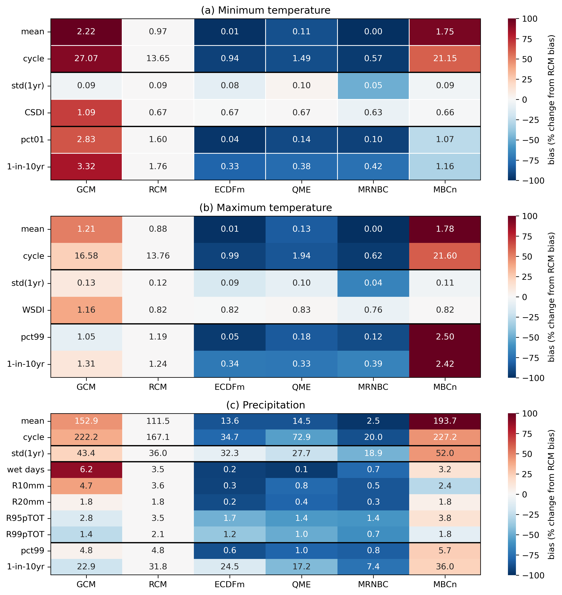
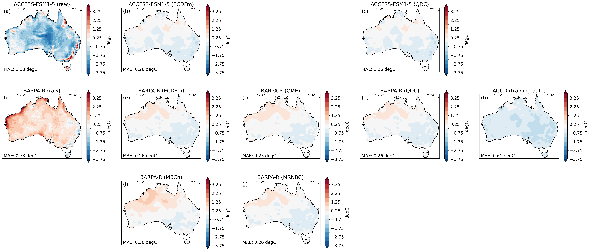
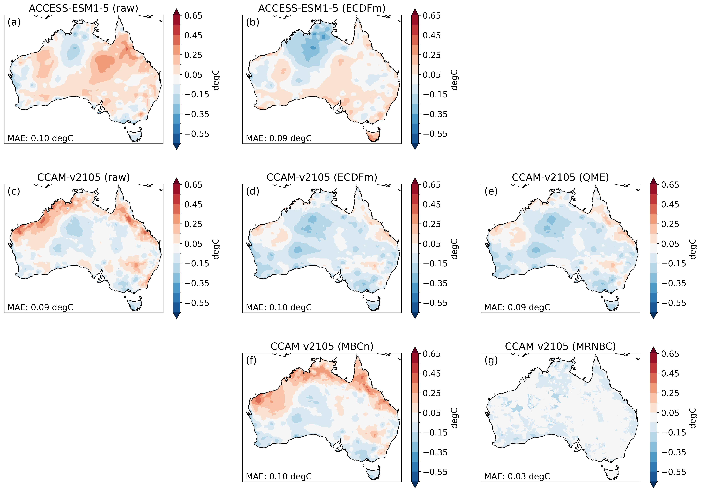
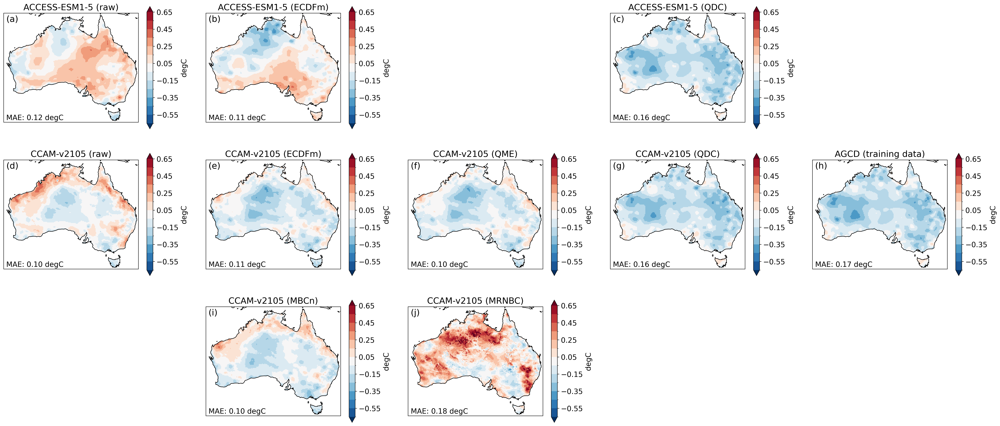
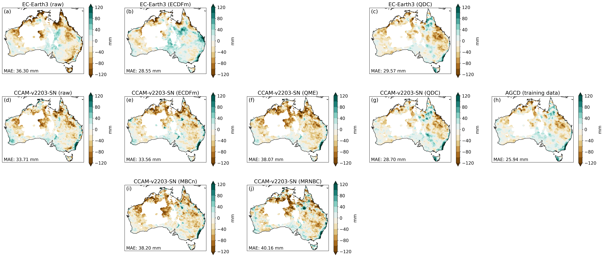
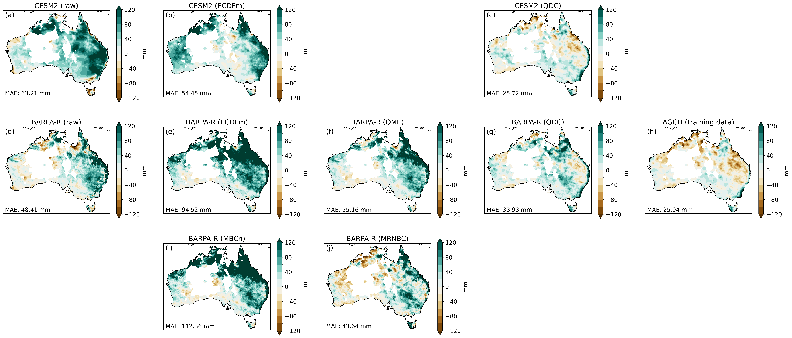
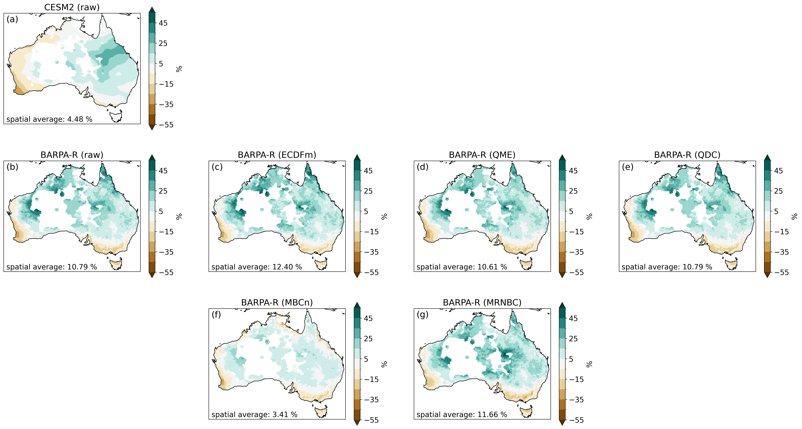

_This report is currently in draft form and is not complete._

# Phase 1 Report

[1. Introduction](#1-introduction)  
[2. Participating bias correction methods](#2-participating-bias-correction-methods)  
&ensp; [2.1. ECDFm](#21-ecdfm)  
&ensp; [2.2. QME](#22-qme)  
&ensp; [2.3. QDC](#23-qdc)  
&ensp; [2.4. MBCn](#24-mbcn)  
&ensp; [2.5. MRNBC](#25-mrnbc)  
[3. Data](#3-data)  
[4. Assessment](#4-assessment)  
[5. Results](#5-results)  
&ensp; [5.1. Temperature climatology](#51-temperature-climatology)  
&ensp; [5.2. Temperature variability](#52-temperature-variability)  
&ensp; [5.3. Temperature extremes](#53-temperature-extremes)  
&ensp; [5.4. Temperature trends](#54-temperature-trends)  
&ensp; [5.5. Precipitation climatology](#55-precipitation-climatology)  
&ensp; [5.6. Precipitation variability](#56-precipitation-variability)  
&ensp; [5.7. Precipitation daily distribution](#57-precipitation-daily-distribution)  
&ensp; [5.8. Precipitation extremes](#58-precipitation-extremes)  
&ensp; [5.9. Precipitation trends](#59-precipitation-trends)   
[6. Discussion](#6-discussion)  

## 1. Introduction

The [Climate Projections Roadmap for Australia](https://www.dcceew.gov.au/climate-change/publications/climate-projections-roadmap-for-australia)
has been developed by the Department of Climate Change, Energy, the Environment and Water
through a collaborative effort of the Australian climate projections community.
The roadmap is shared vision statement of this new partnership,
called the National Partnership for Climate Projections (NPCP),
that aims to develop a consistent approach to deliver comparable,
robust, fit-for-purpose future climate information to assess climate risks and inform adaptation planning.

The roadmap identifies a number of priorities areas of collaboration for the NPCP,
including the delivery of national and regional downscaled climate projections.
This involves model selection, downscaling models, bias correction and calibration,
as well as secondary and next-level analysis (e.g., hazard modelling).

When it comes to bias correction there is no "one size fits all" solution.
Over the years, various different methods have been applied by the major projects,
universities, and government agencies involved in the NPCP.
Each of these methods have their own pros and cons and are suitable for different applications.
The associated bias correction software also varies
from code that was written for a specific research application (and sometimes subsequently abandoned)
to code that is actively maintained by software engineers and regularly re-used.

In order to deliver the projections data described in the Climate Projections Roadmap for Australia,
there was a clear need to establish an NPCP bias correction intercomparison project
to identify the most appropriate bias correction methods.
The first major initiative listed by the Roadmap is the production of
national-scale climate projections by the Australian Climate Service (ACS).
The first phase of the bias correction intercomparison was therefore
designed to support that initiative.
It focused on bias correction methods that are available to the ACS right now
(i.e. with functional software that is sufficiently well documented)
and applied those methods to a subset of the CORDEX (and corresponding CMIP6) data
that will be used by the ACS to generate nation-wide projections.
Since existing bias correction assessments produced by NPCP partners
only provide information on some of the available bias correction methods
for specific contexts such as the Queensland spatial domain
([Zhang et al 2024](https://doi.org/10.1002/met.2204))
or for national hydrological modelling
([Vogel et al 2023](https://doi.org/10.1016/j.jhydrol.2023.129693),
[Peter et al 2024](https://doi.org/10.5194/gmd-17-2755-2024)),
there was a need to produce a general Australia-wide assessment
of all the available bias correction methods.

This report documents the results of the first phase
of the NPCP bias correction intercomparison project.

## 2. Participating bias correction methods

The first step in a typical bias correction procedure involves
establishing a statistical relationship or transfer function
between model outputs and observations over a reference (i.e. historical/training) time period.
The established transfer function is then applied to the target model data
(e.g. future model projections) in order to produce a "bias corrected" model time series.
There are a wide variety of transfer functions / bias correction methodologies out there,
ranging from relatively simple methods that take a single variable as input
to more sophisticated multi-variate approaches.

Through a series of NPCP meetings and workshops on the topic of bias correction,
five methods were identified as being available for use by the ACS right now:
- Equi-distant/ratio Cumulative Density Function matching (ECDFm; univariate)
- Quantile Matching for Extremes (QME; univariate)
- Quantile Delta Change (QDC; univariate)
- N-Dimensional Multi-Variate Bias Correction (MBCn; multivariate)
- Multivariate Recursive Nesting Bias Correction (MRNBC; multivariate)

Some of these methods have been used previously in major projects undertaken
by the CSIRO and/or the Bureau of Meteorology.
For instance, the QDC method was used to produce application ready climate data 
for the [Climate Change in Australia](https://www.climatechangeinaustralia.gov.au/) project,
while the QME and MRNBC methods were used to produce the latest
national hydrological projections for Australia
([Peter et al 2024](https://doi.org/10.5194/gmd-17-2755-2024)).
The QME method has also been used by the National Environmental Science Program
(e.g. [Dowdy et al 2019](https://doi.org/10.1038/s41598-019-46362-x))
and the Energy Sector Climate Information project
(e.g. [Dowdy et al 2021](https://www.climatechangeinaustralia.gov.au/media/ccia/2.2/cms_page_media/799/ESCI%20Technical%20Report%20-%20Standardised%20Method_1.pdf))
In contrast, the ECDFm and MBCn methods have not yet been used in a
major CSIRO or Bureau of Meteorology project,
but there is interest in determining their potential for future projects.

The most simple bias correction procedure is mean scaling,
where the difference or ratio between the mean model and observed value
over the reference/training period (i.e. the mean bias)
is removed (via subtraction or division) from the target model data
in order to produce the bias corrected model time series.
Quantile-based methods are a popular and slightly more sophisticated approach,
where the bias is calculated for a series of quantiles (instead of just the mean)
and then removed from the corresponding quantiles of the target model data.
The ECDFm method is essentially the most basic quantile-based bias correction method available.
The QME method is slightly more complicated in that it involves scaling the data
before matching the model and observations by quantile.
Prior to removing the quantile biases from the target model,
the bias correction factors at the extreme ends of the distribution are also modified
in an attempt to avoid potential overfitting or an excessive influence of very rare events.

While it is technically a "delta change" method as opposed to a "bias correction" method,
the QDC method was also included in the assessment.
In contrast to bias correction,
delta change approaches establish a transfer function between reference and future model outputs
(e.g. from an historical model experiment and future climate emission scenario experiment)
and then apply that transfer function to observations to create a future time series.
The QDC method is conceptually very similar to ECDFm
and is essentially the most basic quantile-based delta change method available.

Unlike the univariate approaches,
multivariate techniques tend to be iterative,
whereby a bias correction method is applied repeatedly until convergence is reached
(i.e. until the biases are no longer getting smaller).
The MBCn method is quantile-based,
repeatedly applying a multivariate orthogonal rotation to the data followed by the univariate QDC method.
In contrast, the MRNBC method is not quantile-based
and instead attempts to address biases in serial dependence
by correcting the data for biases in the mean, standard deviation and lag-0 and lag-1 auto and cross correlations
at multiple timescales (daily, monthly, seasonal and annual).

Each of the methods is described in more detail below.

### 2.1. ECDFm

#### 2.1.1. Method

In _equidistant cumulative density function matching_
([Li et al, 2010](https://doi.org/10.1029/2009JD012882)),
the transfer function represents the distance (i.e. arithmetic difference)
between the observations and model for each quantile of the training period.
Those differences are then added to the target model data
according to the quantile each target data point represents over the target period.
For instance, if a target temperature of $25^{\circ}$ Celsius corresponds to the 0.5 quantile
(i.e. the median) in the target data,
the difference between the median value in the observations and reference model data
is added to the target value in order to obtain the bias adjusted value.
The underlying assumption is that the distance between the model and observed quantiles during the training period
also applies to the target period, hence the name *equidistant*.
The reference to *CDF matching* is clear from the mathematical representation of the method:

$$x_{m-adjust} = x_{m,p} + F_{o,h}^{-1}(F_{m,p}(x_{m,p})) - F_{m,h}^{-1}(F_{m,p}(x_{m,p}))$$

where $F$ is the CDF of either the observations ($o$) or model ($m$)
for a historic training period ($h$) or target period ($p$).
That means $F_{o,h}^{-1}$ and $F_{m,h}^{-1}$ are the quantile functions (inverse CDF
corresponding to the observations and model respectively.
Returning to our target median value of $25^{\circ}$ (i.e. $x_{m,p} = 25$),
the corresponding CDF would return a value of 0.5 (i.e. $F_{m,p}(25) = 0.5$).
The difference between the observed ( $F_{o,h}^{-1}(0.5)$ )
and reference model ( $F_{m,h}^{-1}(0.5)$ ) median values
would then be added to the target value of $25^{\circ}$ to get a bias corrected value.

For precipitation, multiplicative as opposed to additive bias correction is preferred
to avoid the possibility of getting bias corrected values less than zero.
In this case, *equiratio CDF matching* ([Wang and Chen, 2013](https://doi.org/10.1002/asl2.454)) is used:

$$x_{m-adjust} = x_{m,p} \times (F_{o,h}^{-1}(F_{m,p}(x_{m,p})) \div F_{m,h}^{-1}(F_{m,p}(x_{m,p})))$$

#### 2.1.2. Software (and implementation choices)

The code used to implement the ECDFm method is maintained by the CSIRO
and is openly available on GitHub ([Irving 2024](https://doi.org/10.5281/zenodo.12523625)).
The code basically implements the [bias adjustment and downscaling](https://xclim.readthedocs.io/en/stable/sdba.html)
functionality available in the widely used open source xclim library
([Bourgault et al, 2023](https://doi.org/10.21105/joss.05415)).

There are a number of decisions to make when implementing the ECDFm method:
- _Time grouping_:
  It is common calculate bias correction adjustment factors for individual seasons or months separately
  in order to avoid conflating different times of the year
  (e.g. spring and autumn temperatures often occupy the same annual quantile space but may be biased in different ways).
  For the NPCP intercomparsion, adjustment factors were calculated for each month.
- _Quantiles_:
  The software allows the user to specify the number of quantiles for which to calculate an adjustment factor.
  We aim to have approximately 10-15 data values between each quantile.
  For the NPCP bias correction tasks (that train on 30 or 40 years of daily data),
  that means 100 quantiles for each month.
- _Adjustment factor smoothing_:
  The bias correction applied to each target data point is the closest value from the array of adjustment factors.
  In this case, it is a 12 (months) by 100 (quantiles) array
  and linear interpolation/smoothing is applied along the month axis.
  That means the adjustment factor for a target data point from 29 July that corresponds to the 0.651 quantile
  will be a linear combination of the adjustment factors for the nearest quantile (0.65) from both July and August.
- _Singularity stochastic removal_ ([Vrac et al, 2016](https://doi.org/10.1002/2015JD024511))
  is used to avoid divide by zero errors in the analysis of precipitation data.
  All near-zero values (i.e. values less than a very small positive threshold value)
  are set to a small random non-zero value prior to data processing,
  and then after the bias correction process is complete any values less than the threshold are set to zero.

### 2.2. QME

#### 2.2.1. Method

The _quantile matching for extremes_ ([Dowdy 2023](http://www.bom.gov.au/research/publications/researchreports/BRR-087.pdf))
method involves clipping model and observed data to a valid range
and then scaling that clipped data to an integer value between 0 and 500 (typically)
before applying a quantile-based transfer function.
This scaling can be thought of as binning the data
(in this case, a histogram with 500 bins).

A typical valid data range might be -30C to 60C for daily maximum temperature (tasmax),
-45C to 50C for daily minimum temperature (tasmin),
or 0mm to 1250mm for daily precipitation (pr).
The following scaling formulas (used in the NPCP intercomparison)
map the valid range of data values across the 500 integer values/bins: 
- (tasmax + 35) * 5
- (tasmin + 55) * 5
- alog(pr + 1) * 70, where alog is the natural logarithm 

A small value of 0.1mm would have a scaled value of alog(0.1 + 1) * 70 = 6.7,
which is rounded to an integer value / bin number of 7.
The largest valid rainfall amount of 1250mm would have a scaled value of alog(1250 + 1 ) * 70 = 499.2 (rounded to 499).

Once the clipping and scaling has been performed (i.e. once the data has been binned), 
the quantile corresponding to each of the populated bins in the scaled model data is determined.
The transfer function represents the arithmetic difference
between each model bin value and the value of the same quanilte in the scaled observations.
Those differences are then added to all the model data points in each bin respectively.
Similar to ECDFm, there is the option to apply the transfer function in a multiplicative
rather than addition fashion,
but additive is the default for all variables (even precipitation).

To avoid potential overfitting or an excessive influence of very rare events,
before the adjustment factor for each bin is applied to the model data
the factors for the N most extreme high and extreme low bins (typically N=3)
are replaced by the value from the neighbouring histogram bin
(i.e., the histogram bin that is one place less extreme than the third highest value in the sample).
The reference to _extremes_ in the name of the method is a nod to these tweaks
to the bias adjustments in the tails of the distribution. 

#### 2.2.2. Software (and implementation choices) 

The original IDL code used to implement the QME method is maintained by Andrew Dowdy at the University of Melbourne.
A copy of the code as at October 2023 is included in the appendix of the Bureau of Meteorology research report
that documents the QME method ([Dowdy 2023](http://www.bom.gov.au/research/publications/researchreports/BRR-087.pdf)),
while the very latest version is available from Andrew by request.
The Bureau of Meteorology has also written a Python implementation of the method
that is openly available on GitHub ([Gammon 2025](https://doi.org/10.5281/zenodo.14635627)).

There are a number of decisions to make when implementing the QME method.
All of the general features described above are customisable, including the
valid range for data clipping,
scaling formula,
number of histogram bins,
and the N most extreme bins.
There are also additional options as follows:
- _Time grouping_:
  Similar to ECDFm, it is common to apply the QME method to individual seasons or months separately.
  Each month’s histogram can also use data from adjacent months to increase the sample size (i.e., providing a 3-month moving average).
  Monthly time grouping was used for this NPCP intercomparsion and adjacent months were included for precipitation.
- _Adjustment factor smoothing_:
  A moving (boxcar) average can be applied over the range of bias correction values (i.e. for bins 0 to 500).
  For this intercomparison a 21-point moving average was used.
- _Adjustment limits_:
  The software allows the user to specify a maximum adjustment/correction. 
  The default setting for precipitation (used in this intercomparison)
  is for a maximum increase of 50% applied to values great than or equal to 10mm.
  For instance, a model daily precipitation value of 20mm could potentially be bias corrected
  up to a maximum value of 30mm.
  For precipitation, there is an additional default option (which can be overriden)
  that values of 0 rainfall be left unchanged (i.e. no bias correction is applied). 
- _Trend matching_: The long-term trend in the data can be removed prior to applying the bias correction,
  and then added back in after the bias correction has been applied in order to ensure that the bias correction
  does not substantially alter the model simulated trend.
  This option was applied for the temperature data in the projection assessment task (described below).

### 2.3. QDC

#### 2.3.1 Method

One of the most widely used methods for producing climate projection data is the so-called "delta change" approach.
Rather than use the data from a model simulation of the future climate directly,
the delta change approach calculates the relative change between a future and historical modelled time period.
That relative change is then applied to observed data from the same historical time period in order to produce an "application ready" time series for the future period.

While the simplest application of the delta change approach is to apply the mean model change to the observed data,
a popular alternative is to calculate and apply the delta changes on a quantile by quantile basis
(i.e. to adjust the variance of the distribution as opposed to just the mean).
For instance, if an observed historical temperature of $25^{\circ}$ Celsius corresponds to the 0.5 quantile (i.e. the median) in the observed data,
the difference between the median value in the future and historical model data is added to that observed historical temperature
in order to obtain the projected future temperature.

This *quantile delta change* (QDC) approach
([Olsson et al 2009](https://doi.org/10.1016/j.atmosres.2009.01.015);
[Willems & Vrac 2011](https://doi.org/10.1016/j.jhydrol.2011.02.030))
is expressed mathematically as follows:

$$x_{o,p} = x_{o,h} + F_{m,p}^{-1}(F_{o,h}(x_{o,h})) - F_{m,h}^{-1}(F_{o,h}(x_{o,h}))$$

where $F$ is the CDF of either the observations ($o$) or model ($m$) for an historic ($h$) or future/projection period ($p$).
That means $F_{m,p}^{-1}$ and $F_{m,h}^{-1}$ are the quantile functions (inverse CDF)
corresponding to the future and historical model simulations respectively.
Returning to our observed median value of $25^{\circ}$ (i.e. $x_{o,h} = 25$),
the corresponding CDF would return a value of 0.5 (i.e. $F_{o,h}(25) = 0.5$).
The difference between the future ( $F_{m,p}^{-1}(0.5)$ ) and historical model ( $F_{m,h}^{-1}(0.5)$ ) median values
would then be added to the observed value of $25^{\circ}$ to get the projected future temperature.

For variables like precipitation, multiplicative as opposed to additive mapping is preferred
to avoid the possibility of producing future values less than zero:

$$x_{o,p} = x_{o,h} \times (F_{m,p}^{-1}(F_{o,h}(x_{o,h})) \div F_{m,h}^{-1}(F_{o,h}(x_{o,h})))$$

#### 2.3.2. Software (and implementation choices)

Since both methods are conceptually very similar,
the QDC method is implemented using the same software as the ECDFm method
([Irving 2024](https://doi.org/10.5281/zenodo.12523625)).
The same implementation choices are made regarding time grouping, quantiles and singularity stochastic removal.
The only difference is when processing precipitation data (a multiplicative application of QDC)
we've found that in many locations the model bias in the timing of the seasonal cycle
means that monthly time grouping dramatically modifies the climate trend in the data
(i.e. the mean change between the future data produced by QDC and the observations
is much different than the mean change between the future and historical model simulations).
As such, we don't apply any time grouping when applying QDC to precipitation data
and use 1000 quantiles in order to still have 10-15 data values between each quantile. 

### 2.4. MBCn

#### 2.4.1. Method

> TODO

#### 2.4.2. Software (and implementation choices)

> TODO: The MBCn code is available on GitHub ([Gammon and Dao, 2025](https://doi.org/10.5281/zenodo.14708960)).

### 2.5. MRNBC

#### 2.5.1. Method

The _Multivariate Recursive Nested Bias Correction_ (MRNBC) method
corrects multiple variables at the same time and preserves their interdependence at multiple time scales.
It was progressively developed from the nested bias correction (NBC; [Johnson and Sharma, 2012](https://doi.org/10.1029/2011WR010464))
and recursive nested bias correction techniques (RNBC; [Mehrotra and Sharma, 2012](https://doi.org/10.1029/2012WR012446)).
The NBC corrects the distribution (mean and standard deviation) and persistence (lag 1 autocorrelation coefficient)
at monthly, seasonal, and annual timescales using a standard autoregressive lag 1 model ([Srikanthan and Pegram, 2009](https://doi.org/10.1016/j.jhydrol.2009.03.025)).
The MRNBC method is a multivariate version of the above RNBC method.
It simultaneously corrects many model variables,
using a multivariate first-order autoregressive model at daily, monthly, quarterly, and annual timescales
to impart observed distributional and persistence properties of the input fields ([Mehrotra and Sharma, 2015](https://doi.org/10.1016/j.jhydrol.2014.11.037)).

> TODO: Provide more details so it can be compared to / contrasted with the other methods used in this report.

#### 2.5.2. Software (and implementation choices)

> TODO: The MRNBC code is available on GitHub ([Gammon and Kapoor, 2025](https://doi.org/10.5281/zenodo.14641854)).

## 3. Data

The model data used for the intercomparison was taken from the multi-scenario,
multi-model ensemble of simulations from regional climate models (RCMs)
produced by NPCP partner organisations.
These data will ultimately be submitted to the Coordinated Regional Climate Downscaling Experiment (CORDEX)
and will form the basis for much of the climate projection information delivered by NPCP members.

The subset of the NPCP CORDEX data we used
was the daily timescale temperature and precipitation data
from RCM simulations forced by Coupled Model Intercomparsion Project phase 6
(CMIP6; [Eyring et al 2016](https://doi.org/10.5194/gmd-9-1937-2016))
global climate model (GCM) data from the
ACCESS-ESM1-5, CESM2 and EC-Earth3 models for the
historical (available for the years 1960-2014)
and SSP-3.70 (2015-2100) experiments.
Data from three different RCM modelling groups was assessed: 
a `BOM-BARPA-R` submission from the Bureau of Meteorology produced by running the 
Bureau of Meteorology Atmospheric Regional Projections for Australia
(BARPA; [Su et al, 2022](http://www.bom.gov.au/research/publications/researchreports/BRR-069.pdf)) RCM,
a `CSIRO-CCAM-2203` submission from CSIRO produced by running the 
Conformal Cubic Atmospheric Model (CCAM; find reference) RCM,
and a `UQ-DES-CCAM-2105` submission from the
University of Queensland and the Queensland Department of Environment and Science
produced by running a different configuration of CCAM
([Chapman et al, 2023](https://doi.org/10.1029/2023EF003548)).

The observational / reference data used was the Australian Gridded Climate Data (AGCD) dataset
([Evans et al 2020](http://www.bom.gov.au/research/publications/researchreports/BRR-041.pdf),
[Jones et al 2009](http://www.bom.gov.au/jshess/docs/2009/jones.pdf)).

The spatial resolution of the datasets ranged from 0.05 degrees of latitude and longitude for AGCD
to 0.2 degrees for UQ-DES-CCAM-2015 over the entire landmass of Australia.
When comparing RCM data against observations of higher spatial resolution,
differences can arise not only from model bias/errors (which bias correction seeks to remove),
but also from the resolution (or scale) gap between the datasets.
The latter discrepancy — which is not a model error —
is known as the representativeness problem
([Zwiers et al 2011](https://doi.org/10.1007/978-94-007-6692-1_13)).
In order to avoid this problem in the intercomparison,
all data were regridded to the 0.2 degree grid using conservative remapping.

## 4. Assessment

Three tasks were completed for each of the bias correction methods (for each of the GCM/RCM combinations):
- **Task 1 (Calibration)**: Produce bias corrected data for the 1980-2019 period, using 1980-2019 as a training period.
- **Task 2 (Cross validation)**: Produce bias corrected data for the 1990-2019 period, using 1960-1989 as a training period.
- **Task 3 (Projection)**: Produce bias corrected data for the 2060-2099 period, using 1980-2019 as a training period.

The rationale for the calibration task was to assess how well the bias correction methods perform
when they train on exactly the same data that they correct.
This is the most basic test of a bias correction method -
if a method cannot adequately correct the very data it was trained upon,
it is unlikely to be a useful method.
Conversely, if a method performs too well on the calibration task,
this can in some cases be an indication of over-fitting.
In other words,
validating a bias correction method on the same data that was used to calibrate the method
can give the impression that the method is more skilful than it actually is.

The rationale for the cross validation task was to avoid the impression of artificial skill
by validating the bias correction methods on data that was not used for calibration.
It also allowed for the QDC method to be directly compared to the bias correction methods,
because for the calibration task the QDC method simply reproduces the original observations.
Cross validation is the gold standard for weather forecast verification,
because temporal synchronicity is expected between the forecast data and observations.
In the context bias correction validation,
the value of cross validation is limited by internal climate variability
(i.e. temporal synchronicity is not expected between the RCM data and observations;
[Maraun 2016](https://doi.org/10.1007/s40641-016-0050-x),
[Maraun et al 2017](https://doi.org/10.1038/nclimate3418)),
but it is still a widely used approach.
Performing both a calibration and cross validation task
allowed for comparison of results from two approaches with different, non-overlapping limitations
(i.e. artificial skill versus internal variability).

Finally, the projection task was included to see if the bias correction methods
substantially modify the trend simulated by the models.
Trend modification is a problem for many bias correction methods
(e.g. [Zhang et al 2024](https://doi.org/10.1002/met.2204)).

Since the ensemble of GCMs selected for dynamical downscaling by RCMs is only a subset of the full CMIP6 ensemble,
some scientists and institutions participating in the NPCP
are also interested in applying bias correction directly to GCM output.
In order to better understand how GCM outputs that have been dynamically downscaled and then bias corrected
compare to GCM outputs that are directly bias corrected,
the three assessment tasks were also completed on GCM output
using the ECDFm and QDC methods.

The data arising from each bias correction method was compared on a number of metrics
relating to the ability to capture the observed
climatology, variability, distribution (precipitation only), extremes, trends and the link between different variables (Table 1).
A number of additional metrics were assessed during the drafting of the report
(e.g. give examples),
but they did not add to the broad conclusions captured by the metrics listed in Table 1.

| Category | Metric | Description |
| ---      | ---    | ---         |
| Climatology | Annual climatology | Annual mean |
| Climatology | Seasonal cycle | Sum of the absolute value of the difference between the bias corrected model and observed climatological mean value for each month |
| Variability | Interannual variability | Standard deviation of the annual mean timeseries |
| Variability | Multi-year variability | Standard deviation of the 5-year running mean timeseries |
| Variability (temperature) | Warm-spell duration index (WSDI) | Numer of days where, in intervals of at least 6 consecutive days, daily Tmax > 90th percentile calculated for a 5-day window centred on each calendar day |
| Variability (temperature) | Cold-spell duration index (CSDI) | Numer of days where, in intervals of at least 6 consecutive days, daily Tmin < 10th percentile calculated for a 5-day window centred on each calendar day |
| Daily distribution (precipitation) | Wet day frequency | Number of wet days (precipitation > 1mm) expressed as a fraction (%) of all days |  
| Daily distribution (precipitation) | R10mm, R20mm | Annual number of heavy precipitation days (precipitation ≥ 10 mm or 20mm) |
| Extremes | 1-in-10 year event | Value corresponding to an annual return interval of 10 years |
| Extremes | 99th percentile | The 99 percentile (or 1.0 percentile for minimum temperature) |
| Extremes (temperature) | Frost day index | Annual number of days with a minimum temperature less than 0◦C |
| Extremes (precipitation) | Drought intensity | Percentage difference between the minimum annual value and the mean annual value (also, with 2-year and 5-year running mean applied) |
| Extremes (precipitation) | R95pTOT, R99pTOT | Fraction of total annual precipitation that falls on very wet days (> 95th or 99th percentile) |
| Trends | Change signal | Change in the annual mean (future period minus the historical period) |

_Table 1: Metrics calculated at each grid point across Australia._

## 5. Results

In order to provide an overview of the performance of each bias correction method,
the results were condensed into a single summary table for the calibration (Figure 1)
and cross validation (Figure 2) tasks.
The tables show the bias in key metrics averaged (using the mean absolute error/bias)
over all grid points and GCM/RCM combinations.
A few of the metrics in Table 1 do not appear in the summary result tables
(e.g. multi-year variability, R10mm)
because they are very similar to closely related metrics
(e.g. interannual variability, R20mm).

The results for each variable and assessment category are discussed in the sections below,
with maps showing the results for all grid points for a representative RCM/GCM as required.
In addition to showing the results for bias corrected RCM and GCM data,
the maps for the cross validation task also show an "AGCD (training data)" result.
This result is derived from simply replicating the AGCD training data
rather than applying a bias correction method.

> TODO: Provide information on where to find plots that weren't included in this report
> (e.g. supplementary information or the notebooks on GitHub).

> TODO: Explain why some metrics in Table 1 aren't in the summary figures.

    
     
    <em>
      Figure 1: Mean absolute error/bias across all grid points and GCM/RCM combinations
      for the calibration assessment task.
      Metrics include the
      annual climatology (mean),
      seasonal cycle (cycle),
      interannual variability (std(1yr)),
      warm spell duration index (WSDI),
      cold spell duration index (CSDI),
      99th or 1st percentile (pct99, pct01),
      1-in-10 year event (1-in-10yr),
      wet day frequency,
      and the annual number of days with greater than 20mm rain (R20mm).
      The number in each cell corresponds to the mean absolute error/bias
      (with units of Celsius, mm or days depending on the metric),
      while the color is that bias value expressed as a percentage change
      relative to the RCM value.
    </em>

    
     
    <em>
      Figure 2: As per Figure 1 but for the cross validation assessment task.
    </em>

### 5.1. Temperature climatology

While RCM output was generally associated with smaller biases
in the temperature annual climatology and seasonal cycle than corresponding GCM output,
some bias still persisted and tended to have its own unique spatial characteristics
(i.e. different from the GCM; e.g. Figure 3).
When bias correction was applied to RCM output
following the calibration assessment task protocol
(i.e. with an overlapping training and correction period),
those biases were typically almost completely eliminated.
The exception was the MBCn method,
which showed a consistent warm bias over the entire continent
for all GCM/RCM combinations (e.g. Figure 3).
Biases in the RCM output were also greatly reduced
(but not completely eliminated) on the cross validation task.
The MBCn method was again the worst performing on cross validation,
but unlike for the calibration task it did reduce the RCM bias (Figure 4).
The residual bias after applying the ECDFm and QDC methods
to RCM and GCM outputs was very similar (e.g. Figures 3 and 4).
This suggests that in the context of producing data with low bias
in the temperature annual climatology and seasonal cycle, 
it does not appear to make much difference
whether GCM data are dynamically downscaled or not prior to applying bias correction.

    
     
    <em>
      Figure 3: Bias in annual mean daily maximum temperature (relative to the AGCD dataset)
      for the "calibration" assessment task.
      Results are shown for the ACCESS-ESM1-5 GCM (top left),
      the BOM-BARPA-R RCM forced by that GCM (bottom left),
      and various bias correction methods applied to those GCM (top row, columns to the right)
      and RCM (middle and bottom rows, columns to the right) data.
      (MAE = mean absolute error.)
    </em>

    
     
    <em>
      Figure 4: Bias in annual mean daily maximum temperature (relative to the AGCD dataset)
      for the "cross validation" assessment task.
      Results are shown for the ACCESS-ESM1-5 GCM (top left),
      the BOM-BARPA-R RCM forced by that GCM (bottom left),
      and various bias correction methods applied to those GCM (top row, columns to the right)
      and RCM (middle and bottom rows, columns to the right) data.
      A reference case where the AGCD training data (1960-1989)
      was simply duplicated for the assessment period (1990-2019) is also shown (bottom right).
      (MAE = mean absolute error.)
    </em>

### 5.2. Temperature variability

GCM biases in interannual and multi-year temperature variability were relatively small
and were not substantially modified by dynamical downscaling
or by most of the bias correction methods (e.g. Figure 5).
The exception was the MNRBC method,
which unlike the other methods does attempt to explicitly correct for
biases in variability at multiple time scales (Section 2.5.1).
The MRNBC method was able to reduce biases in interannual and multi-year temperature variability
on the calibration task (Figure 5) but actually inflated those biases on cross validation (Figure 6).
This may suggest a degree of overfitting by the MRNBC method.

    
     
    <em>
      Figure 6: Bias in interannual variability (relative to the AGCD dataset)
      for the "calibration" assessment task.
      Results are shown for the ACCESS-ESM1-5 GCM (top left),
      the UQ-DES-CCAM-2105 RCM forced by that GCM (bottom left),
      and various bias correction methods applied to those GCM (top row, columns to the right)
      and RCM (middle and bottom rows, columns to the right) data.
      A reference case where the AGCD training data (1960-1989)
      was simply duplicated for the assessment period (1990-2019) is also shown (bottom right).
      (MAE = mean absolute error.)
    </em>

    
     
    <em>
      Figure 6: Bias in interannual variability (relative to the AGCD dataset)
      for the "cross validation" assessment task.
      Results are shown for the ACCESS-ESM1-5 GCM (top left),
      the UQ-DES-CCAM-2105 RCM forced by that GCM (bottom left),
      and various bias correction methods applied to those GCM (top row, columns to the right)
      and RCM (middle and bottom rows, columns to the right) data.
      (MAE = mean absolute error.)
    </em>

With respect to sub-annual variability,
extended periods of persistent hot or cold weather were captured by the WSDI and CSDI respectively.
These indices count the annual number of days that are part of a streak of six or more days
above the 90th percentile (WSDI) or below the 10th percentile (CSDI). 
Both indices show higher values in northern Australia
(where the weather tends to be more persistent / less variable from day to day)
and lower values in the south.

The GCM output tended to overestimate the WSDI and CSDI.
Dynamical downscaling acted to reduce this overestimation (e.g. Figure 7),
but bias correction of the RCM output made no difference.
In contrast, the QDC method was associated with smaller biases than the RCM data.
This is presumably related to the fact that the QDC (delta change) method
pertubs the observed training data (which did a good job of representing the WSDI and CSDI),
whereas the bias correction methods act on the model data.

    
     
    <em>
      Figure 7: Bias in the WSDI (relative to the AGCD dataset)
      for the "cross validation" assessment task.
      Results are shown for the ACCESS-ESM1-5 GCM (top left),
      the BOM-BARPA-R RCM forced by that GCM (bottom left),
      and various bias correction methods applied to those GCM (top row, columns to the right)
      and RCM (middle and bottom rows, columns to the right) data.
      A reference case where the AGCD training data (1960-1989)
      was simply duplicated for the assessment period (1990-2019) is also shown (bottom right).
      (MAE = mean absolute error.)
    </em>

### 5.3. Temperature extremes

For extremes indices related to daily minimum temperature
(i.e. the 1-in-10 year low temperature and the 1st percentile),
RCM output was generally associated with smaller biases than corresponding GCM output.
In contrast, for daily maximum temperature
(i.e. the 1-in-10 year high temperature and the 99th percentile)
RCM output was only associated with smaller biases
for some RCM/GCM combinations but higher biases for others.
For both temperature variables, some bias still persisted after dynamical downscaling
and it tended to have its own unique spatial characteristics
(i.e. different from the GCM; e.g. Figure 8).

When bias correction was applied to RCM output for the calibration task,
those biases were greatly reduced but not completely eliminated.
Similar to the climatology results,
the MBCn method performed substantially worse than the other methods
on daily maximum temperature extremes
(and to a lesser extent daily minimum temperature)
due to a warm bias across the entire continent (e.g. Figure 8).
The MRNBC method performed similarly to ECDFm and QME
for both the calibration and cross validation tasks over most the of continent,
but displayed substantial cool biases in minimum temperature extremes
over high elevation areas in central Tasmania and along the Great Dividing Range (e.g. Figure 8).

As with the temperature climatology metrics,
it did not appear to make much difference for these temperature extremes metrics
whether GCM data are dynamically downscaled or not prior to applying bias correction.

    
     
    <em>
      Figure 8: Bias in the 1-in-10 year low daily minimum temperature (relative to the AGCD dataset)
      for the "calibration" assessment task.
      Results are shown for the EC-Earth3 GCM (top left),
      the BOM-BARPA-R RCM forced by that GCM (bottom left),
      and various bias correction methods applied to those GCM (top row, columns to the right)
      and RCM (middle and bottom rows, columns to the right) data.
      (MAE = mean absolute error.)
    </em>

### 5.4. Temperature trends

With respect to the simulated trend in annual mean daily maximum or minimum temperature,
none of the methods substantially altered the model simulated trend (e.g. Figure 9).
In fact, dynamical downscaling modified the model trend much more than bias correction.

    
     
    <em>
      Figure 9: Change in annual mean daily maximum temperature
      between 1980-2019 and 2060-2099 for the ssp370 experiment.
      Results are shown for a GCM (top left panel),
      RCM forced by that GCM (middle left panel)
      and various bias correction methods applied to those model data (remaining panels).
    </em>

### 5.5. Precipitation climatology

Similar to the temperature results,
RCM output was generally (but not always) associated with smaller biases in
the annual precipitation climatology and seasonal cycle than corresponding GCM output,
but some bias still persisted and could have its own unique spatial characteristics.
When bias correction was applied to RCM output for the calibration task,
those biases were typically dramatically reduced, especially for the MRNBC method.
The exception was the MBCn method,
which showed a consistently large wet bias over the entire continent
for all GCM/RCM combinations.
Biases in the RCM output were also reduced on the cross validation task,
but to a lesser extent than for the calibration task (e.g. Figure 10).
The MRNBC method was no longer the stand out method,
but the MBCn method was again the worst performing on cross validation
due to a consistent wet bias. 
On cross validation,
biases also tended to be (but were not always) lower if the GCM data
were not dynamically downscaled prior to applying bias correction (e.g. Figure 10).

    
     
    <em>
      Figure 10: Bias in annual mean precipitation (relative to the AGCD dataset)
      for the "cross validation" assessment task.
      Results are shown for the ACCESS-ESM1-5 GCM (top left),
      the BOM-BARPA-R RCM forced by that GCM (bottom left),
      and various bias correction methods applied to those GCM (top row, columns to the right)
      and RCM (middle and bottom rows, columns to the right) data.
      A reference case where the AGCD training data (1960-1989)
      was simply duplicated for the assessment period (1990-2019) is also shown (bottom right).
      (MAE = mean absolute error.)
    </em>

### 5.6. Precipitation variability

RCM output was generally associated with similar or slightly reduced bias
in interannual and multi-year precipitation variability (e.g. Figure 11 and 12).
When bias correction was applied to RCM output for the calibration task,
those biases were typically reduced, especially for the MRNBC method.
The exception was the MBCn method,
which was consistently associated with larger biases than the RCM data.
On cross validation, none of the bias correction methods
were consistently associated with lower biases than the RCM data.
The MBCn method was associated with consistently increased biases,
while the ECDFm method differed greatly between GCMs.
It maintained or reduced the mean absolute bias for
dynamically downscaled ACCESS-ESM5-1 or EC-Earth3 data (e.g. Figure 11),
but was associated with very large biases for CESM2 (e.g. Figure 12).
In contrast to the bias correction methods,
the QDC method was associated with consistently lower biases on cross validation (e.g. Figure 11 and 12).
This is likely due to the fact that a simple replication of the training data clearly
outperformed all methods on cross validation,
and the QDC method effectively just applies a small perturbation to the training data.

    
     
    <em>
      Figure 11: Bias in interannual precipitation variability (relative to the AGCD dataset)
      for the "cross validation" assessment task.
      Results are shown for the EC-Earth3 GCM (top left),
      the CSIRO-CCAM-2203 RCM forced by that GCM (bottom left),
      and various bias correction methods applied to those GCM (top row, columns to the right)
      and RCM (middle and bottom rows, columns to the right) data.
      A reference case where the AGCD training data (1960-1989)
      was simply duplicated for the assessment period (1990-2019) is also shown (bottom right).
      (MAE = mean absolute error.)
    </em>

    
     
    <em>
      Figure 12: Bias in interannual precipitation variability (relative to the AGCD dataset)
      for the "cross validation" assessment task.
      Results are shown for the CESM2 GCM (top left),
      the BOM-BARPA-R RCM forced by that GCM (bottom left),
      and various bias correction methods applied to those GCM (top row, columns to the right)
      and RCM (middle and bottom rows, columns to the right) data.
      A reference case where the AGCD training data (1960-1989)
      was simply duplicated for the assessment period (1990-2019) is also shown (bottom right).
      (MAE = mean absolute error.)
    </em>

### 5.7. Precipitation daily distribution

The lower end of the annual precipitation distribution was assessed
by considering the wet day frequency (or conversely the annual number of relatively dry days),
while the upper end was captured by the annual number of days with more than 
10mm (r10mm) or 20mm (r20mm) of precipitation.
Dynamical downscaling tended to reduce GCM bias in wet day frequency
but made little difference to r10mm or r20mm biases.
Bias correction tended to further the reduce the remaining RCM bias,
almost eliminating it completely on the calibration task. 
The exception was again the MBCn method,
for which biases either remained relatively unchanged or increased.

### 5.8. Precipitation extremes

The extreme precipitation results differed depending on the severity of the extreme.

For a less extreme metric like the 99th percentile
(i.e. an event that happens a few times a year),
dynamical downscaling was associated with a similar mean absolute bias
as the corresponding GCM output (e.g. Figure 13).
With the exception of the MBCn method,
all methods reduced the bias in the RCM output on both the calibration
(and to a lesser extent) cross validation tasks.
It was difficult to separate the methods as they all performed similarly.

For a more extreme metric like the 1-in-10 year event,
dynamical downscaling was associated with a larger mean absolute bias than
the corresponding GCM output (e.g. Figure 14).
On the calibration task the various methods could be easily distiguished,
with the MRNBC method reducing the RCM bias to the greatest degree,
followed by the QME and then ECDFm methods.
On cross validation,
the QDC method outperformed all the bias correction methods.
The MRNBC and QME methods performed similarly (a modest reduction in bias),
while the ECDFm method tended not to reduce the RCM bias.

    
     
    <em>
      Figure 13: Bias in the 99th percentile daily precipitation (relative to the AGCD dataset)
      for the "cross validation" assessment task.
      Results are shown for the EC-Earth3 GCM (top left),
      the BOM-BARPA-R RCM forced by that GCM (bottom left),
      various bias correction methods applied to those model data (rows),
      and a reference case where the AGCD training data (1960-1989)
      was simply duplicated for the assessment period (1990-2019) (bottom right).
      (MAE = mean absolute error.)
    </em>

    
     
    <em>
      Figure 14: Bias in the 1-in-10 year high daily precipitation (relative to the AGCD dataset)
      for the "cross validation" assessment task.
      Results are shown for the EC-Earth3 GCM (top left),
      the BOM-BARPA-R RCM forced by that GCM (bottom left),
      various bias correction methods applied to those model data (rows),
      and a reference case where the AGCD training data (1960-1989)
      was simply duplicated for the assessment period (1990-2019) (bottom right).
      (MAE = mean absolute error.)
    </em>

### 5.9. Precipitation trends

Bias correction tended to slightly alter the model simulated rainfall trends (e.g. Figure 15).
The grid point differences in percentage change in annual mean precipitation between 1980-2019 and 2060-2099
beween the raw RCM data and the ECDFm, QME, MBCn and MRNBC data had a mean absolute error across all RCM/GCM cominations
of 3.4%, 2.4%, 9.5% and 4.2%, respectively.
For all RCM/GCM combinations, dynamical downscaling modified the model trend more than bias correction.

    
     
    <em>
      Figure 15: Change in annual mean precipitation
      between 1980-2019 and 2060-2099 for the SSP3-7.0 experiment.
      Results are shown for the CESM2 GCM (left most panel),
      the BOM-BARPA-R RCM forced by that GCM (second from the left)
      and various bias correction methods applied to those model data (remaining panels).
    </em>

## 6. Discussion

The first major initiative on the Climate Projections Roadmap for Australia
is the production of next generation national-scale climate projections.
A primary data source for those projections is the CMIP6 ensemble,
but that dataset does not provide regional-scale or unbiased information.
For many applications (e.g. regional impact modelling),
that means some form of downscaling and bias correction is required.
A number of modelling groups have used RCMs to dynamically downscale CMIP6 data over Australia,
but the resulting CORDEX dataset still has substantial biases
(partly inherited from the driving GCMs).
In order to help select the most appropriate methods for bias correction,
the NPCP established a bias correction intercomparison project.
This paper presents the results of the first phase of that intercomparison,
which focused on assessing the methods available to the ACS right now
for producing a general purpose bias corrected version/s of the CORDEX Australasia dataset.

The intercomparison involved validating the various bias correction methods
against the same observational data that was used to calibrate the methods (the "calibration" task)
and then against different observational data (the "cross validation" task).
These two validation approaches each have their have own limitations,
so results that held up across both were considered more robust. 
Indeed, aside from an obvious difference in the magnitude of the residual bias after bias correction
(cross validation is associated with higher biases due to internal variability)
the relative performance of the bias correction methods
and whether or not they provided any substantial benefit
was similar between the two tasks.
That meant a clear hierarchy between the methods could be identified.

The best performing bias correction methods were QME and MRNBC.
Both methods were effective in reducing model bias for most but not quite all of the assessment metrics.
To understand why bias correction is not equally effective on all metrics,
it is useful to consider the climate system as a multivariate distribution having
marginal, temporal, spatial, and inter-variable aspects
([Maraun et al 2015)](https://doi.org/10.1002/2014EF000259)).
As a quantile-based univariate method applied to each month separately,
the QME method directly modifies the marginal aspects of the distribution
(e.g. the univariate mean and variance)
and also some temporal aspects
(e.g. quantiles, amplitude of the annual cycle, number of threshold exceedances),
but does not modify other temporal aspects (e.g. sequencing, variability)
or any spatial or inter-variable aspects.
It was therefore not surprising that the QME method
had little impact on model bias for
interannual and multi-year variability and weather sequencing (CSDI and WSDI),
which relate to temporal aspects that are not modified by that method. 

The MRNBC method is specifically designed to modify temporal variability,
so its performance on the interannual and multi-year variability metrics
was particularly interesting.
It tended to reduce model bias on the calibration task
but increased it on the cross validation task,
suggesting a degree of overfitting by the method.
(Due to internal climate variability,
to be more certain of an overfitting problem the
cross validation would need to be repeated for multiple different
calibration and assessment periods,
which was beyond the scope of this study.)
The impact of the multivariate MRNBC method on the inter-variable aspects of the distribution
was difficult to assess with the simple metrics employed in our analysis.
For instance, bias in the cross correlation between the monthly mean anomaly timeseries
of precipitation and daily maximum temperature
showed little change with dynamical downscaling or bias correction of any kind (not shown).
Having said that,
when multiple variables are bias corrected for input into a hydrological model
(i.e. a much more sophisticated inter-variable assessment)
it has been shown on assessments similar to our calibration (as opposed to cross-validation) task 
that the MRNBC method outperforms univariate alternatives over Australia
when the hydrological model outputs are compared to observations
([Vogel et al 2023](https://doi.org/10.1016/j.jhydrol.2023.129693)).
 
For most assessment metrics, the ECDFm method performed similarly to QME and MRNBC.
An exception was the two metrics relating to precipitation variability,
for which the ECDFm method ranged from reducing to dramatically increasing the model bias
depending on which RCM/GCM combination was assessed.
The other exception was very extreme precipitation (i.e. the 1-in-10 year event),
for which ECDFm tended to have little effect on the model bias.
In contrast, the QME method (i.e. the other option for univariate bias correction)
essentially did no harm and did not dramatically inflate the model bias
for particular metrics and RCM/GCM combinations.
A detailed analysis of why the QME and ECDFm method performed differently in
specific instances despite their obvious methodological similarities
was beyond the scope of this paper,
but we hypothesise that it could be related to the data transform that the QME method
implements before any quantile matching is performed.

The QDC method compared very favourably to the bias correction methods.
On any given metric it generally performed as well as the best performing bias correction method,
and much better on metrics like CSDI and WSDI where weather sequencing is important.
The method essentially represents a (relatively small) perturbation to the observational record,
so it naturally produces very realistic output.
There are some practical limitations to using the QDC method
(e.g. you can generally only produce 20-40 year time slices as opposed to a continuous timeseries
and you are stuck with the observed sequence of weather events;
[Irving and Macadam 2024](https://doi.org/10.25919/03by-9y62)),
but if those are not a barrier then it appears to be a good option
for producing projections data.

> The points below are still in draft form and need to be incorporated into the text.

General results:
- There's something wrong (either methodologically or implementationally) with the MBCn method.
- Directly bias correcting GCM data (i.e. without dynamical downscaling first)
  appears to be a valid option
  (if low bias on simple metrics like the ones we looked at is important for you application).
  Similar to previous authors,
  we found it was difficult to demonstrate added value of an RCM,
  after both GCM and RCM have been bias corrected
  (e.g. [Eden et al 2014](https://doi.org/10.1002/2014JD021732)).
  The exception was the CSDI and WSDI,
  which were improved by dynamical downscaling but not bias correction.

Caveats:
- Bias correction is not a cure-all. Fundamental model errors cannot be corrected by bias correction.
  Current bias correction methods might improve the applicability of climate simulations,
  but in general cannot improve low model credibility
  ([Maraun et al 2017](https://doi.org/10.1038/nclimate3418)).

What we did with this information:
- We bias corrected the entire CORDEX-CMIP6 archive (for selected variables)
  using the QME and MRBNC methods ([NCI 2025](https://doi.org/10.25914/xeca-pw53))
- We created a QDC-CMIP6 dataset by applying the QDC method to GCM data
  ([Irving and Macadam 2024](https://doi.org/10.25919/03by-9y62); dataset DOI to come).
  In the first instance we used the same GCMs that were downscaled,
  but that dataset can be expanded to include other GCMs.

What would be the focus of a future phase of the NPCP bias correction intercomparison?
- sub-daily timescales
